# mcp-release-notifier

> An agentic pipeline that listens to GitHub releases, generates professional release notes with AI, and delivers a PDF to Discord — built with MCP, FastAPI, and the Claude API.

---

⚠️ **Heads up**

This is a personal learning project — not an official Anthropic or MCP resource.
It may contain errors, simplifications, or opinionated choices made for clarity over correctness.
Think of it as a **warm-up project**: a hands-on way to get comfortable with MCP before tackling the recommended courses at the end of this README.

Before you dive in, please keep a few important things in mind:
1. **Fast-Paced AI Evolution:** The AI landscape moves incredibly fast. While specific tools, libraries, or minor implementation details might change over time, the core concepts, protocol primitives, and foundational logic taught here will remain highly relevant.
2. **Third-Party Interfaces:** UI screenshots, website layouts, and external platforms (like GitHub, Discord, or developer consoles) are completely out of my control and will likely change. Focus on the underlying logic — the workflow steps and connection mechanics remain the same regardless of the visual wrap.
3. **Built with AI Assistance:** This tutorial was written with AI help — mainly for English refinement and phrasing. The architecture, curriculum, and all technical decisions are my own.

---

# Key Concepts Demonstrated

✅ MCP Server Development 
<br>✅ MCP Client Development
<br>✅ Tool Discovery
<br>✅ Resource Discovery
<br>✅ Prompt Discovery
<br>✅ Agentic Tool Calling
<br>✅ Event-Driven AI Workflows
<br>✅ Webhook Architectures
<br>✅ PDF Generation Pipelines

<a name="table-of-contents_"></a>

---

## Table of Contents

- [What is MCP?](#what-is-mcp_)
- [Project Architecture](#project-architecture_)
- [Requirements](#requirements_)
- [Setup](#setup_)
- [Project Structure](#project-structure_)
- [Part 01 — 🖥️ MCP Server Setup](#part-1)
- [Part 02 — 🖥️🔧 Adding Tools](#part-2)
- [Part 03 — 🖥️🔧🔍 Testing Tools](#part-3)
- [Part 04 — 🖥️📚 Adding Resources](#part-4)
- [Part 05 — 🖥️📚🔍 Testing Resources](#part-5)
- [Part 06 — 🖥️✍️ Adding Prompts](#part-6)
- [Part 07 — 🖥️✍️🔍 Testing Prompts](#part-7)
- [Part 08 — 🔌 MCP Client Setup](#part-8)
- [Part 09 — 🔌🔧🔍 Testing Tools](#part-9)
- [Part 10 — 🔌📚🔍 Testing Resources](#part-10)
- [Part 11 — 🔌✍️🔍 Testing Prompts](#part-11)
- [Part 12 — 🔌🤖 The AI Pipeline](#part-12)
- [Part 13 — 🔌🚀 Running the Pipeline](#part-13)
- [Part 14 — ⚡ FastAPI Webhook](#part-14)
- [Part 15 — 🌐 Cloudflared](#part-15)
- [Part 16 — 🐙 GitHub Webhook](#part-16)
- [Part 17 — 🔗 Full Pipeline](#part-17)
- [Part 18 — 🎮 Discord Setup](#part-18)
- [Part 19 — 📤 Sending the PDF](#part-19)
- [Part 20 — 🐙 GitHub MCP Server](#part-20)
- [Next Steps & Resources](#next-steps--resources_)
- [Get in Touch](#get-in-touch_)


<a name="what-is-mcp_"></a>

---


## What is MCP?

#### ⚡ Quick Navigation: [⬅️ Table of Contents](#table-of-contents_) | [Project Architecture ➡️](#project-architecture_)


Imagine an AI as a person locked in a dark room. They can think, reason, and answer questions — but only based on what they already know, plus the context of the current conversation. No internet, no smartphone, no real-time data. *Just memory — their training data and the context they've been given.*

**MCP opens the door.**

**Before MCP**, connecting an AI to an external tool or data source meant writing custom code every time — fragile integrations that broke whenever a third-party service changed.

**MCP standardises that connection layer.**

If you're building an app and want to add AI capabilities that reach beyond the model itself — external tools, live data, third-party services — it can be up and running in minutes, not days.

**A practical example:**

❌ **Without MCP:** GitHub has a Web API with hundreds of actions. If you want your app to interact with GitHub via AI, you write custom integration code. If you have a second app that also needs GitHub, you write it again. And if GitHub changes or deprecates an endpoint — both apps break.

✅ **With MCP:** GitHub exposes an MCP Server. Your app connects to it, asks *"what can you do?"*, gets the list of available tools, feeds them to the AI model, and the model figures out how to use them. 💡 One protocol. Any app. Any model. Cool right?! 😎

MCP exposes three primitives:

| Primitive | Analogy | Description |
|---|---|---|
| **Tool** | POST request | An action with side effects (generate PDF, send message) |
| **Resource** | GET request | Read-only data source (files, database records) |
| **Prompt** | Template | Reusable message templates for LLM interactions |

This project uses all three.

### Watch this 10 minute video from IBM - MCP vs API: Simplifying AI Agent Integration with External Data
[](https://youtu.be/7j1t3UZA1TY)

[↑ Back to Table of Contents](#table-of-contents_)

<a name="project-architecture_"></a>

---


## Project Architecture

#### ⚡ Quick Navigation: [⬅️ What is MCP?](#what-is-mcp_) | [Requirements ➡️](#requirements_)

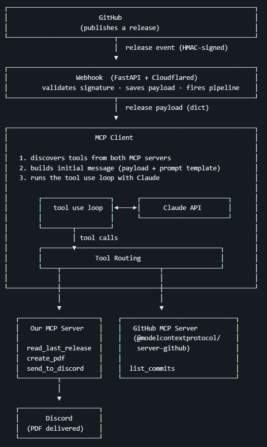

[↑ Back to Table of Contents](#table-of-contents_)

<a name="requirements_"></a>

---


## Requirements

#### ⚡ Quick Navigation: [⬅️ Project Architecture](#project-architecture_) | [Setup ➡️](#setup_)


- Python 3.10+
- A GitHub account
- A Discord server (you control)
- An Anthropic API key → [console.anthropic.com](https://console.anthropic.com)
- Nodejs installed → [nodejs.org](https://nodejs.org)

[↑ Back to Table of Contents](#table-of-contents_)

<a name="setup_"></a>

---


## Setup

#### ⚡ Quick Navigation: [⬅️ Requirements](#requirements_) | [Project Structure ➡️](#project-structure_)


> 🚨 **Note on tooling:** I'm using `pip` throughout this project for simplicity and accessibility. The MCP ecosystem recommends `uv` (a faster Python package manager), but if you're not familiar with it yet, `pip` works perfectly here. Feel free to switch to `uv` if you prefer.
> All examples in this project are built and tested with `pip` — not `uv`.

### 1. Clone the repository

```bash
git clone https://github.com/hasff/mcp-release-notifier.git
cd mcp-release-notifier
```

### 2. Create a virtual environment

```bash
python -m venv venv

# Windows
venv\Scripts\activate

# macOS / Linux
source venv/bin/activate
```

[↑ Back to Table of Contents](#table-of-contents_)

<a name="project-structure_"></a>

---


## Project Structure

#### ⚡ Quick Navigation: [⬅️ Setup](#setup_) | [Part 01 ➡️](#part-1)

``` 
mcp-release-notifier/
├── .env.example
├── .gitignore
├── README.md
│
├── MCP_Server/
│   ├── server_v1.py          ← Part 01: bare server
│   ├── server_v2.py          ← Part 02–03: + tools
│   ├── server_v3.py          ← Part 04–05: + resources
│   ├── server_v4.py          ← Part 06–07: + prompts
│   ├── server_v5.py          ← Part 19: + send_to_discord
│   ├── release_data/         ← webhook payloads (git-ignored)
│   └── output/               ← generated PDFs (git-ignored)
│
├── MCP_Client/
│   ├── helpers.py            ← DebugList (Part 13)
│   ├── client_v1.py          ← Part 08: connection setup
│   ├── client_v2.py          ← Part 09: testing tools
│   ├── client_v3.py          ← Part 10: testing resources
│   ├── client_v4.py          ← Part 11: testing prompts
│   ├── client_v5.py          ← Part 12: AI pipeline
│   ├── client_v6.py          ← Part 13: debug + experiments
│   ├── client_v7.py          ← Part 19: + send_to_discord
│   └── client_v8.py          ← Part 20: + GitHub MCP Server
│
├── FastAPI_Webhook/
│   ├── webhook_v1.py         ← Part 14: basic webhook
│   ├── webhook_v2.py         ← Part 17: + signature verification
│   ├── webhook_v3.py         ← Part 19: uses client_v7
│   └── webhook_v4.py         ← Part 20: uses client_v8
│
└── assets/
    ├── imgs/
    └── part_XX/              ← screenshots per part
```

> ⚠️ Each part folder will be detailed as the project progresses.

[↑ Back to Table of Contents](#table-of-contents_)

<a name="part-1"></a>

---

# 🖥️ MCP Server
## Part 01 — 🖥️ MCP Server Setup  

#### ⚡ Quick Navigation: [⬅️ Project Structure](#project-structure_) | [Part 02 — 🖥️🔧 Adding Tools ➡️](#part-2)


> 📒 **What you'll learn:** How to scaffold a minimal MCP server — valid, runnable, but intentionally empty.

---


### Theory

MCP follows a **client-server architecture**:

- The **MCP Server** exposes capabilities — tools, resources, and prompts.
- The **MCP Client** connects to the server, discovers what's available, and exposes those capabilities to the AI model — which then decides how to use them.

Think of the server as a **capability provider**: it doesn't decide when or how its tools are used — it just makes them available. The intelligence lives on the client side.

> 💡 **In practice**, most developers interact with MCP as **clients** — connecting to servers that already exist (GitHub, Notion, Slack...). Building your own server is less common, and typically you'd focus on one side or the other. In this project, we build both — but that's intentional: the goal is to understand the full picture, not to model a production setup.


---


### Install dependencies

```bash
pip install "mcp[cli]"
```

> ⚠️ **`mcp` vs `fastmcp` — important distinction:**
> - `mcp` → official package, **Author: Anthropic, PBC** → [pypi.org/project/mcp](https://pypi.org/project/mcp)
> - `fastmcp` → third-party package, **Author: Jeremiah Lowin / Prefect** → [pypi.org/project/fastmcp](https://pypi.org/project/fastmcp)
>
> Despite the similar name, they are maintained by completely different teams. Having both installed can cause conflicts. **This project uses `mcp` only** — `FastMCP` is simply a class exposed inside the official Anthropic package (`mcp.server.fastmcp`).

> 💡 **Why `[cli]`?**
> The `[cli]` extra installs additional tools needed to run and inspect your server locally — including the **MCP Inspector**, which we'll use in Part 03. Without it, you'd have the core library but none of the dev tooling.

---


### Code walkthrough

> 📄 **File:** `MCP_Server/server_v1.py`
```python
# 1 — Import
from mcp.server.fastmcp import FastMCP

# 2 — Create server instance
mcp = FastMCP("release-notifier")

# TODO

# 3 — Run
if __name__ == "__main__":
    mcp.run()
```

**# 1 — Import:**
Imports the `FastMCP` class from the official `mcp` package. This class handles all the MCP protocol boilerplate — you just define tools, resources, and prompts on top of it.

**# 2 — Create server instance:**
Creates your server instance. The string `"release-notifier"` is the server name — it's what clients see when they connect and ask *"what server am I talking to?"*.

**# 3 — Run:**
Starts the server. By default, it uses **stdio transport** — the server communicates via standard input/output, which means the MCP client and the MCP server run on the **same machine**.

> 💡 **Transport is just a detail.** MCP is **transport-agnostic** — the core concepts (tools, resources, prompts) work the same regardless of whether communication happens over stdio (local) or HTTP (remote). The transport choice may affect some low-level behaviour, but that's beyond the scope of this project. Here we use stdio.
>
> 🐇 **Want to go deeper?** Ask an AI: *"What is the difference between HTTP+SSE and StreamableHTTP in MCP, and why might you need to disable notifications in HTTP-based transports?"*

[⬆️ **`Part 1`**](#part-1)

---


### Run it

Curious to see if it's already alive? Run this in your terminal:

```bash
mcp dev MCP_Server/server_v1.py
```

You should see something like this:

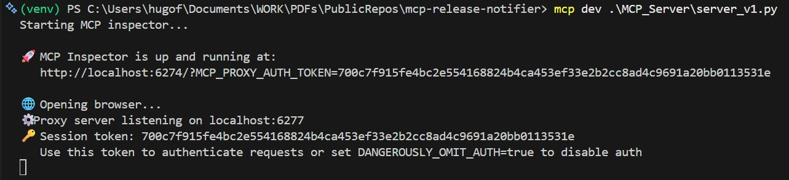

Now open the URL shown in the terminal. You'll land on the MCP Inspector:

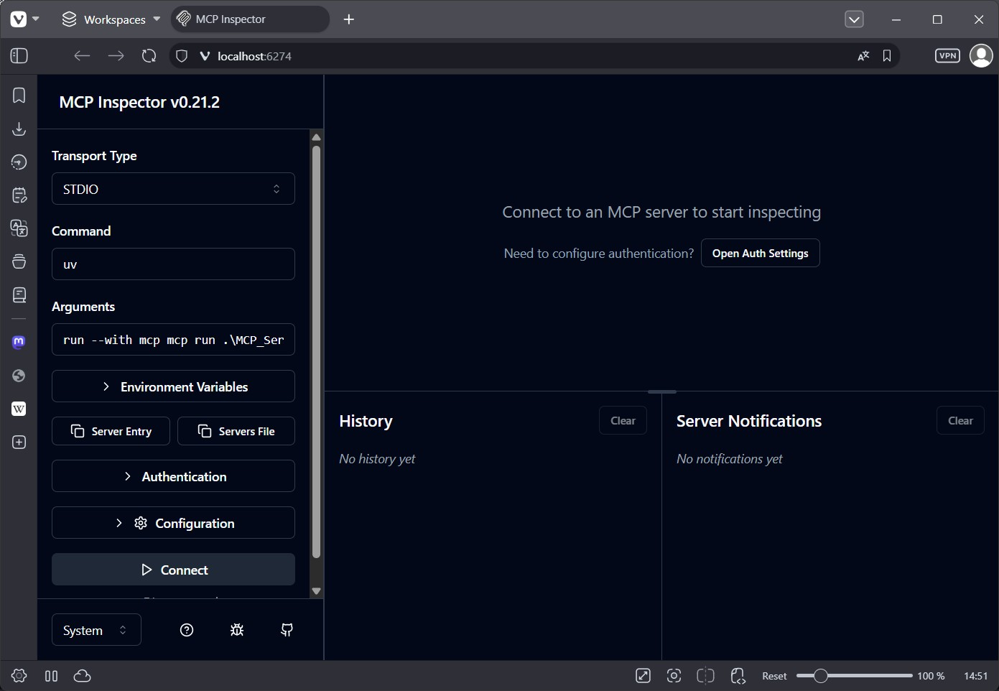


1) **Command field** - The Inspector pre-fills this, you should change accordingly with your system:
    - Windows: typically `py`
    - macOS / Linux: typically `python` or `python3`

2) **Arguments** field should contain the path to your server file (e.g. `MCP_Server/server_v1.py`).

3) Click **Connect** to establish the connection with your server.

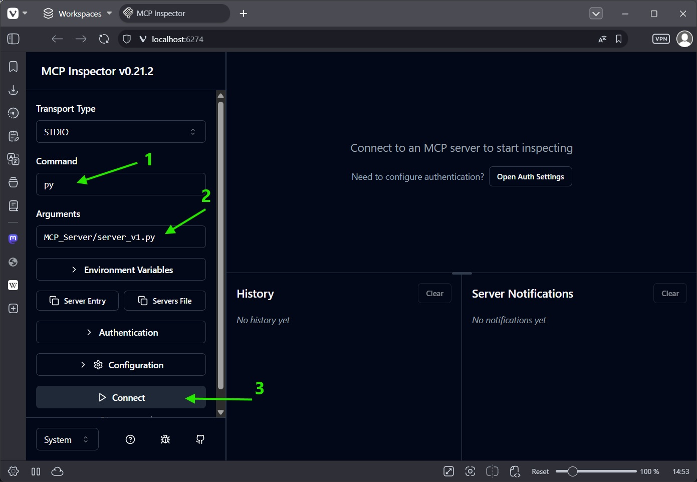


Once connected — no tools, no resources, nothing yet. But the server is alive and responding. ✅

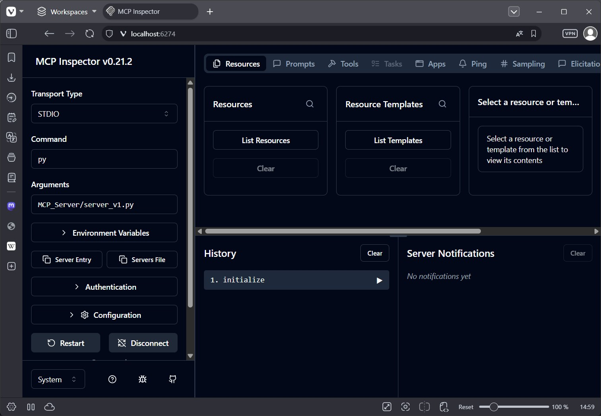

❎ When you're done, press `Ctrl + C` in the terminal to stop the server.

---


> 💡 **MCP Curiosity**
> MCP was publicly released by Anthropic in November 2024 — but it was designed from the start as an **open standard**, not an Anthropic-exclusive protocol. Any AI model, any client, any server can implement it. The goal is interoperability, not lock-in.

[↑ Back to Table of Contents](#table-of-contents_)

<a name="part-2"></a>

---

## Part 02 — 🖥️🔧 Adding Tools

#### ⚡ Quick Navigation: [⬅️ Part 01 — 🖥️ MCP Server Setup](#part-1) | [Part 03 — 🖥️🔧🔍 Testing Tools ➡️](#part-3)

> 📒 **What you'll learn:** How to define and register tools in an MCP server — and why the registration step matters.

---


### Theory

In MCP, a **Tool** is a callable function the AI can invoke — something with side effects, like reading a file or generating a PDF.

But just defining a Python function isn't enough. The MCP server needs to know the function exists. That registration step is what makes the difference between a plain Python function and an MCP tool.

In this part we'll add two tools to our server:

- `read_last_release` — reads the latest release JSON from `release_data/`
- `create_pdf` — generates a PDF and saves it to `output/`

The folder structure looks like this:

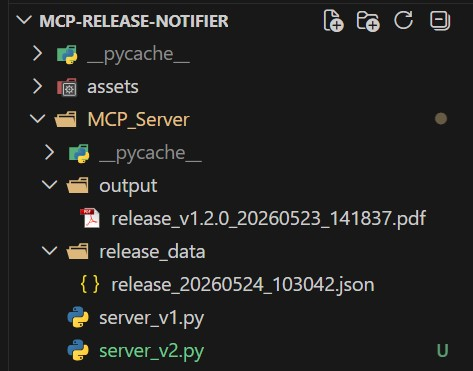

---


### Install dependencies

```bash
pip install reportlab
```

> 💡 **What is ReportLab?**
> ReportLab is a Python library for generating PDFs programmatically. Our `create_pdf` tool will use it to build a structured PDF from the release notes data.

---


### Code walkthrough

> 📄 **File:** `MCP_Server/server_v2.py`

#### Step 1 — Imports

```python
# 1 — Standard library
import json
from pathlib import Path
from datetime import datetime

# 2 — MCP
from mcp.server.fastmcp import FastMCP

# 3 — ReportLab
from reportlab.lib.pagesizes import A4
from reportlab.platypus import SimpleDocTemplate, Paragraph, Spacer
from reportlab.lib.styles import getSampleStyleSheet
```

**# 1 — Standard library:**
`json` handles reading the release JSON files. `Path` gives us a clean, cross-platform way to work with file paths. `datetime` is used to timestamp the generated PDF filenames.

**# 2 — MCP:**
Already covered in Part 01 — this is the `FastMCP` class that powers our server.

**# 3 — ReportLab:**
`A4` defines the page size. `SimpleDocTemplate` is the PDF document builder. `Paragraph` and `Spacer` are layout elements — text blocks and vertical spacing. `getSampleStyleSheet` provides a set of pre-built text styles (Title, Heading, Normal).

[⬆️ **`Part 2`**](#part-2)

---


#### Step 2 — Project paths

```python
# ─────────────────────────────────────────────
# ⚙️ CONFIGURATION
# ─────────────────────────────────────────────
BASE_DIR = Path(__file__).parent
RELEASE_DATA_DIR = BASE_DIR / "release_data"
OUTPUT_DIR = BASE_DIR / "output"
OUTPUT_DIR.mkdir(exist_ok=True)
```

`BASE_DIR` is the directory where `server_v2.py` lives. Everything else is relative to it — `release_data/` is where the input JSON files come from, and `output/` is where generated PDFs will be saved. `OUTPUT_DIR.mkdir(exist_ok=True)` ensures the folder is created automatically if it doesn't exist yet.

---


#### Step 3 — Define the functions (plain Python)

Before registering anything with MCP, let's define the two functions as plain Python:

```python
# read_last_release — reads the latest JSON from release_data/
def read_last_release() -> dict: ...

# create_pdf — generates a PDF and saves it to output/
def create_pdf(version: str, repo_name: str, release_notes: str, published_at: str) -> dict: ...
```

> ⚠️ At this point these are just regular Python functions. The MCP server has no idea they exist — nothing has been registered yet. We'll fix that in the next step.

> 📄 **Full implementation:** `MCP_Server/server_v2.py`

---


#### Step 4 — Register the tools with MCP

To expose a function as an MCP tool, we add the `@mcp.tool()` decorator:

```python
# ─────────────────────────────────────────────
# 🔧 TOOL 1 — read last release
# ─────────────────────────────────────────────
@mcp.tool()
def read_last_release() -> dict:
    """Reads the most recent release payload from release_data/."""
    ...

# ─────────────────────────────────────────────
# 🔧 TOOL 2 — create PDF
# ─────────────────────────────────────────────
@mcp.tool()
def create_pdf(version: str, repo_name: str, release_notes: str, published_at: str) -> dict:
    """
    Generates a PDF with the release notes.
    Returns the output filename.

    Args:
        version: The release version tag (e.g. 'v1.2.0')
        repo_name: The repository name (e.g. 'mcp-release-notifier')
        release_notes: The full release notes text
        published_at: ISO 8601 timestamp of the release
    """
    ...
```

Three things to note here:

**`@mcp.tool()`** — `mcp` is not a generic name. It refers to the server instance we created in Part 01: `mcp = FastMCP("release-notifier")`. The decorator registers the function with that specific server.

**`@mcp.tool()` vs `@mcp.tool(description="...")`** — Both work. The docstring approach (used here) is more Pythonic and keeps the description close to the code. Passing `description=` directly in the decorator is an alternative — pick the one that fits your style.

**Docstrings matter for AI** — The description at the top of each function, and the `Args:` block for each parameter, are not just for human readers. FastMCP exposes them to the AI model so it knows what each tool does and how to call it correctly. The clearer the description, the better the model performs.

---


> 💡 **MCP Curiosity**
> Every MCP server publishes a machine-readable catalog — `tools/list`, `resources/list`, `prompts/list`. This means an AI agent can discover new capabilities at runtime without any code changes on the client side.

[↑ Back to Table of Contents](#table-of-contents_)

<a name="part-3"></a>

---

## Part 03 — 🖥️🔧🔍 Testing Tools

#### ⚡ Quick Navigation: [⬅️ Part 02 — 🖥️🔧 Adding Tools](#part-2) | [Part 04 — 🖥️📚 Adding Resources ➡️](#part-4)

> 📒 **What you'll learn:** How to use the MCP Inspector to test your tools — call them manually, inspect their output, and verify the full flow before wiring anything to a client.

---


### What is the MCP Inspector?

The MCP Inspector is an official browser-based UI that lets you interact with any MCP server without writing a client. Think of it as **Postman for MCP** — it's the fastest way to verify your server works before connecting it to anything else.

---


### Run it

```bash
mcp dev MCP_Server/server_v2.py
```

You should see something like this in your terminal:

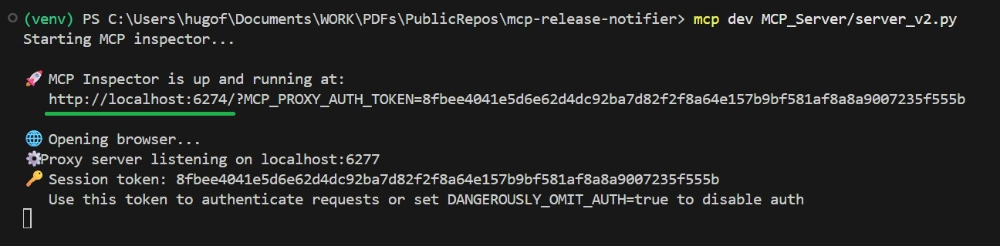

Open the URL shown in the terminal (in this case is `http://localhost:6274`).

---


### Connect to your server

On the connection screen, verify the pre-filled fields and click **Connect**:

- **1) Command** — `py` on Windows, `python` or `python3` on macOS/Linux
- **2) Arguments** — path to your server file: `MCP_Server/server_v2.py`
- **3) Connect** — click to establish the connection

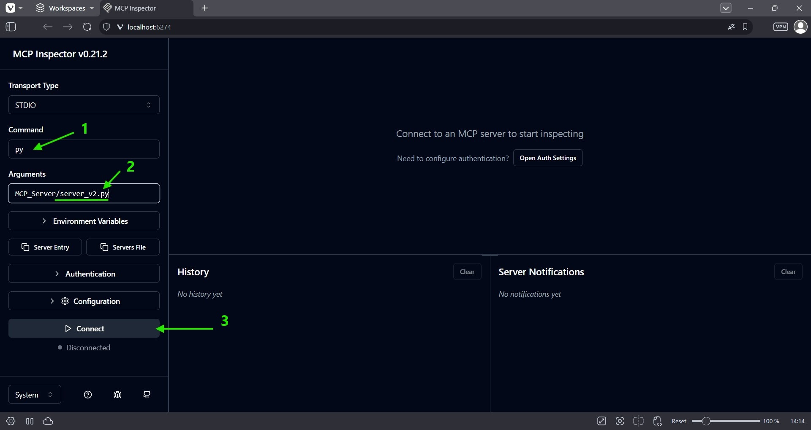

---


### Navigate to Tools

Once connected, click **Tools** in the top navigation bar.

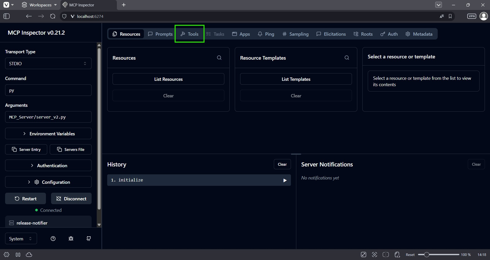

Then click **List Tools** to fetch the tools registered on your server.

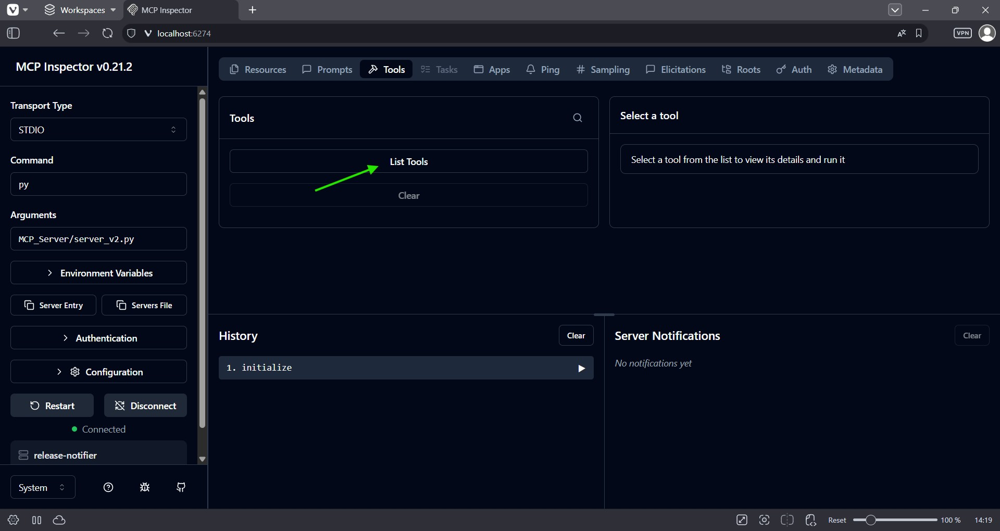

You should now see both tools available — `read_last_release` and `create_pdf`.

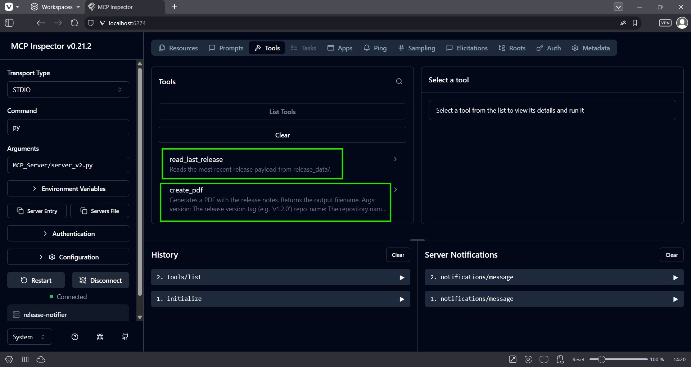

[⬆️ **`Part 3`**](#part-3)

---


### Test 1 — `read_last_release`

Click **`read_last_release`** to select it.

This tool takes no parameters — just click **Run Tool**.

- **1) `read_last_release`** — select tool
- **2) Run Tool** — click to execute

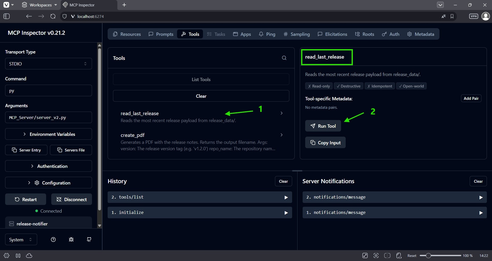

The result should be the JSON content of the latest file in `release_data/`:

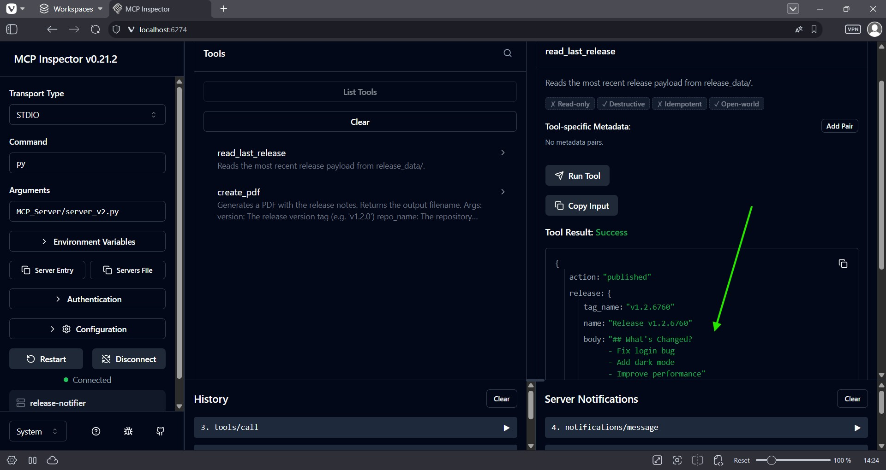

```json
{
  "action": "published",
  "release": {
    "tag_name": "v1.2.6760",
    "name": "Release v1.2.6760",
    "body": "## What's Changed? \n- Fix login bug\n- Add dark mode\n- Improve performance",
    "published_at": "2025-05-23T10:00:00Z",
    "html_url": "https://github.com/user/repo/releases/tag/v1.2.0"
  },
  "repository": {
    "name": "mcp-release-notifier",
    "full_name": "user/mcp-release-notifier",
    "html_url": "https://github.com/user/mcp-release-notifier"
  }
}
```

✅ Tool working correctly.

[⬆️ **`Part 3`**](#part-3)

---


### Test 2 — `create_pdf`

Click **`create_pdf`** to select it.

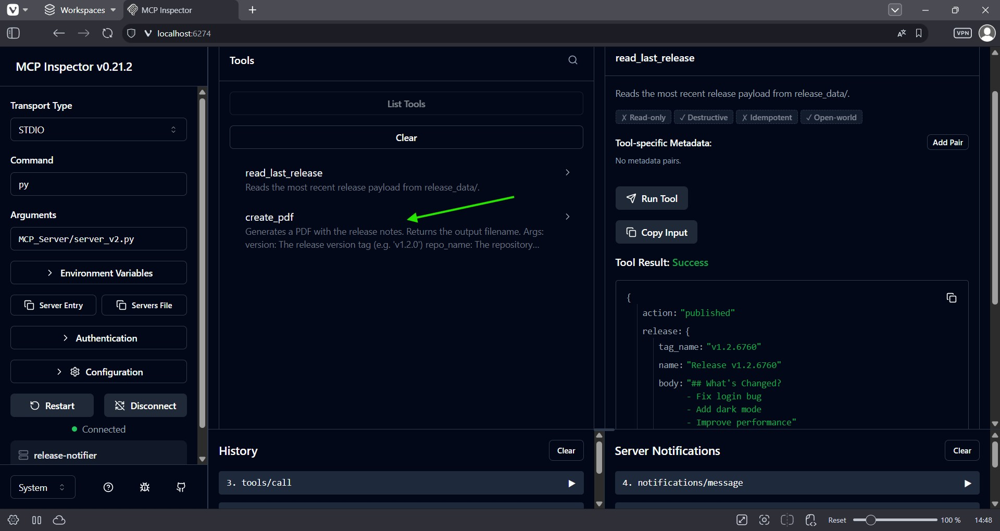

This tool requires four parameters. Fill them in with any test values:

| Parameter | Example value |
|---|---|
| `version` | `123` |
| `repo_name` | `my_repo/example` |
| `release_notes` | `This is a demo!` |
| `published_at` | `2026-05-26` |

Then click **Run Tool**.

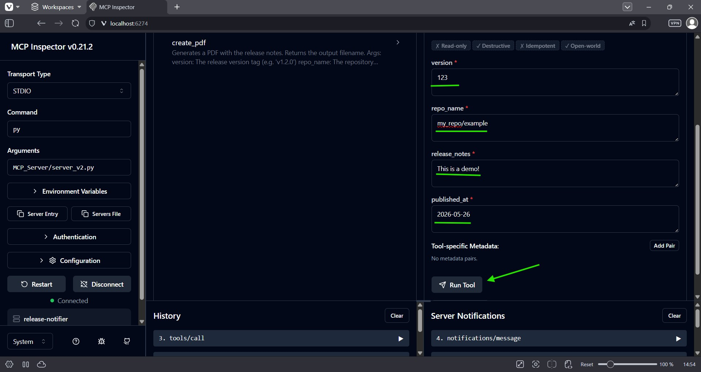

You should see **Tool Result: Success** with the output path:

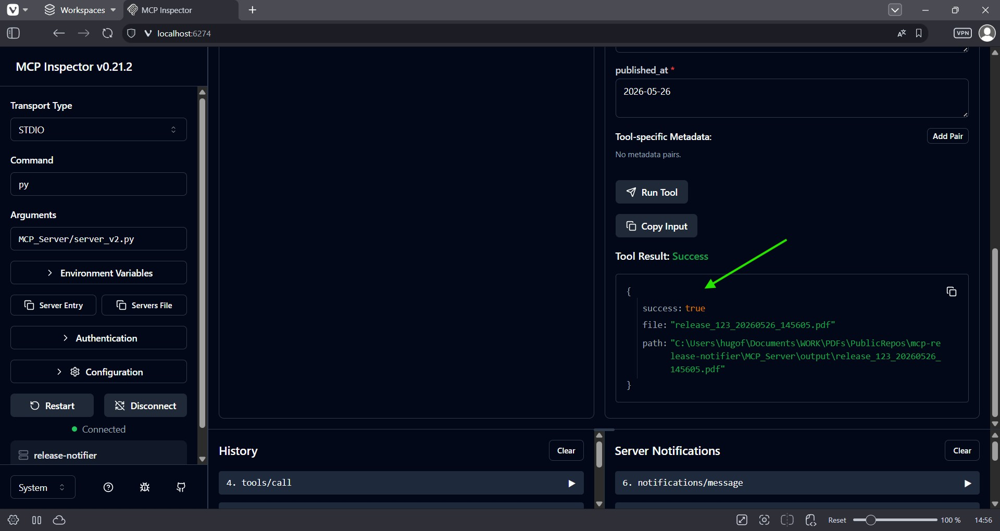

```json
{
  "success": true,
  "file": "release_123_20260526_145605.pdf",
  "path": "C:\\Users\\...\\MCP_Server\\output\\release_123_20260526_145605.pdf"
}
```

Open the `output/` folder in your project — the PDF should be there. Open it to confirm the content matches what you passed in:

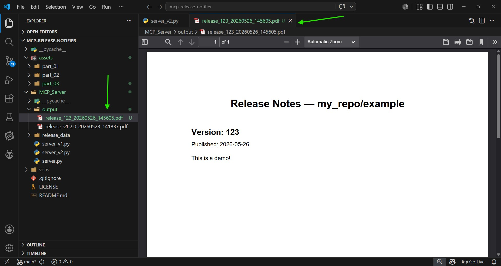

✅ Both tools verified end-to-end.

---


### What to keep in mind

> ⚠️ The MCP Inspector sends one tool call at a time — it's a manual testing environment, not an AI agent. In later parts, the AI client will chain these calls automatically based on the task.

❎ When you're done, press `Ctrl + C` in the terminal to stop the server.

---


> 💡 **MCP Curiosity**
> The MCP Inspector is itself an MCP client — it implements the full protocol to discover and call tools, just like your future AI-powered client will. The difference is that a human drives it here, not a model.

[↑ Back to Table of Contents](#table-of-contents_)

<a name="part-4"></a>

---

## Part 04 — 🖥️📚 Adding Resources

#### ⚡ Quick Navigation: [⬅️ Part 03 — 🖥️🔧🔍 Testing Tools](#part-3) | [Part 05 — 🖥️📚🔍 Testing Resources ➡️](#part-5)

> 📒 **What you'll learn:** How to define and register resources in an MCP server — the difference between static and template resources, how URIs work, and when to use `mime_type`.

---


### Theory

In MCP, a **Resource** is a read-only data source the AI (or a human) can read — something without side effects, like listing files or fetching a record.

The key distinction from Tools:

| | Tool | Resource |
|---|---|---|
| Analogy | POST request | GET request |
| Side effects | Yes | No |
| Use case | Do something | Read something |
| Example | `create_pdf` | `releases://list` |

Resources are registered with `@mcp.resource()` — the same pattern as `@mcp.tool()`.

---


### ⚠️ Important context for this project

> **Resources in this project exist for demonstration purposes only.**
>
> In our automated pipeline, the LLM will follow explicit tool-call instructions:
> `read_last_release()` → `create_pdf()`. Resources are not part of that flow.
>
> Where resources shine is in **ad-hoc, human-driven queries** — a developer asking
> *"what releases do we have?"* or *"show me the notes for release X"* — without
> triggering the full pipeline.

This is a deliberate design choice, not a gap. Tools handle the pipeline; resources handle exploration.

---


### URIs

Every resource is identified by a **URI** — a string that uniquely addresses it.

MCP URIs follow this pattern:

```
scheme://path
```

You define the scheme yourself. In this project we use `releases://`:

| URI | Type | Description |
|---|---|---|
| `releases://list` | Static | Fixed address, always the same resource |
| `releases://by/{id}` | Template | Dynamic address, `{id}` is a parameter |

> 💡 **URIs are not URLs.** They don't point to an HTTP endpoint — they're just identifiers within the MCP protocol. The scheme (`releases://`) is arbitrary; you define it when you register the resource.

---


### Static vs Template Resources

**Static resource** — fixed URI, content resolved dynamically at read time:
```python
@mcp.resource("releases://list", ...)
def list_releases() -> str: ...
```
The address never changes. The content can — every call re-reads the folder.

**Template resource** — URI with a `{parameter}`, resolved per request:
```python
@mcp.resource("releases://by/{id}", ...)
def get_release_by_id(id: str) -> str: ...
```
The `{id}` in the URI maps directly to the `id: str` parameter in the function. FastMCP handles the extraction automatically.

[⬆️ **`Part 4`**](#part-4)

---


### mime_type

`mime_type` is metadata the server sends to the client so it knows how to interpret the content — the same principle as `Content-Type` in HTTP. **FastMCP** defaults to `text/plain` if omitted, but being explicit is good practice.

Common values:

| mime_type | When to use |
|---|---|
| `application/json` | Structured data |
| `text/plain` | Free text, logs, changelogs |
| `text/markdown` | Documentation, READMEs |
| `text/html` | Web content |

In this project:
- `releases://list` → `application/json` (returns a structured list)
- `releases://by/{id}` → `text/plain` (returns the release notes body as free text)

> 💡 **Note:** Unlike Tools, we pass `description` as a parameter directly in `@mcp.resource()` — not as a docstring. Both approaches are valid in FastMCP; for resources the decorator parameter keeps the metadata co-located with the URI and mime_type declaration, making it easier to read.

---


### Code walkthrough

> 📄 **File:** `MCP_Server/server_v3.py`

#### Resource 1 — Static resource

```python
# ─────────────────────────────────────────────
# 📚 RESOURCE 1 — static resource
# Lists all available release IDs from release_data (sorted, most recent last).
# Type: Static resource — fixed URI, dynamic content resolved at read time.
# ─────────────────────────────────────────────
@mcp.resource(
    "releases://list",
    description="Lists all available release IDs from release_data",
    mime_type="application/json"
)
def list_releases() -> str:
    files = sorted(RELEASE_DATA_DIR.glob("release_[0-9]*.json"))
    if not files:
        return json.dumps({"error": "No release files found in release_data"})
    ids = [f.stem for f in files]  # e.g. ["release_20260524_103042", ...]
    return json.dumps({"releases": ids, "count": len(ids)})
```
> ⚠️ **Production note:** Error handling is intentionally minimal to keep the focus on MCP concepts. In production you'd want proper exception handling and logging.

**`@mcp.resource("releases://list", ...)`** — registers a static resource at a fixed URI.

**`description=`** — passed directly as a decorator parameter (instead of a docstring). 
The client uses this to understand what the resource provides — visible in the MCP Inspector 
and in any application that calls `resources/list`.

**`mime_type="application/json"`** — tells the client the response is structured JSON.

**`f.stem`** — returns the filename without extension. This gives us exactly the `id` format that Resource 2 expects: `release_20260524_103042`.

---


#### Resource 2 — Template resource

```python
# ─────────────────────────────────────────────
# 📚 RESOURCE 2 — template resource
# Returns a specific release notes by id (e.g. releases://by/release_20260524_103042).
# Type: Template resource — URI with parameter {id}, resolved dynamically per request.
# ─────────────────────────────────────────────
@mcp.resource(
    "releases://by/{id}",
    description="Returns the release notes body by id as plain text",
    mime_type="text/plain"
)
def get_release_by_id(id: str) -> str:
    path = RELEASE_DATA_DIR / f"{id}.json"
    if not path.exists():
        return f"{id}.json not found in release_data"
    data = json.loads(path.read_text(encoding="utf-8"))
    return data["release"]["body"]
```
> ⚠️ **Production note:** Error handling is intentionally minimal to keep the focus on MCP concepts. In production you'd want proper exception handling and logging.

**`"releases://by/{id}"`** — the `{id}` placeholder makes this a template resource. FastMCP extracts the value from the URI and passes it to `id: str` automatically.

**`mime_type="text/plain"`** — the function returns only `data["release"]["body"]`, which is free text (e.g. `"## What's Changed?\n- Fix login bug\n..."`). Genuinely plain text, no JSON wrapper.

**The two resources are designed to chain naturally:**
```
releases://list            → discover available IDs
releases://by/{id}         → fetch the notes for a specific one
```

---


> 💡 **MCP Curiosity**
> Resources are exposed via `resources/list` and `resources/read` in the MCP protocol. A client can call `resources/list` at any time to discover what's available — no hardcoding needed. This is the same discovery mechanism used by Tools (`tools/list`) and Prompts (`prompts/list`).

[↑ Back to Table of Contents](#table-of-contents_)

<a name="part-5"></a>

---

## Part 05 — 🖥️📚🔍 Testing Resources

#### ⚡ Quick Navigation: [⬅️ Part 04 — 🖥️📚 Adding Resources](#part-4) | [Part 06 — 🖥️✍️ Adding Prompts ➡️](#part-6)


> 📒 **What you'll learn:** How to test static and template resources in the MCP Inspector — and how the Inspector separates them into two distinct sections.

---


### Run it

```bash
mcp dev MCP_Server/server_v3.py
```

Open the URL shown in the terminal and connect:

- **Command** — `py` on Windows, `python` or `python3` on macOS/Linux
- **Arguments** — `MCP_Server/server_v3.py`
- Click **Connect**

---


### Navigate to Resources

Once connected, click **Resources** in the top navigation bar. You'll notice two separate sections — **Resources** (for static) and **Resource Templates** (for template resources).

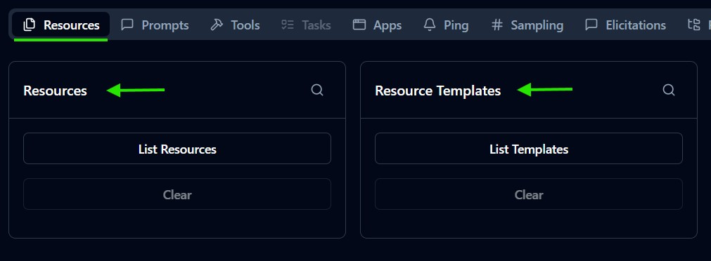

> 💡 This matches the MCP protocol: static resources are exposed via `resources/list`, template resources via `resources/templates/list` — two separate endpoints.

---


### Test 1 — `releases://list` (Static Resource)

In the **Resources** section, click **List Resources**. You should see `list_releases` appear below.

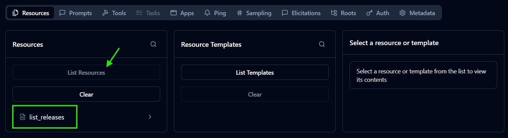

Click **`list_releases`** to read it.

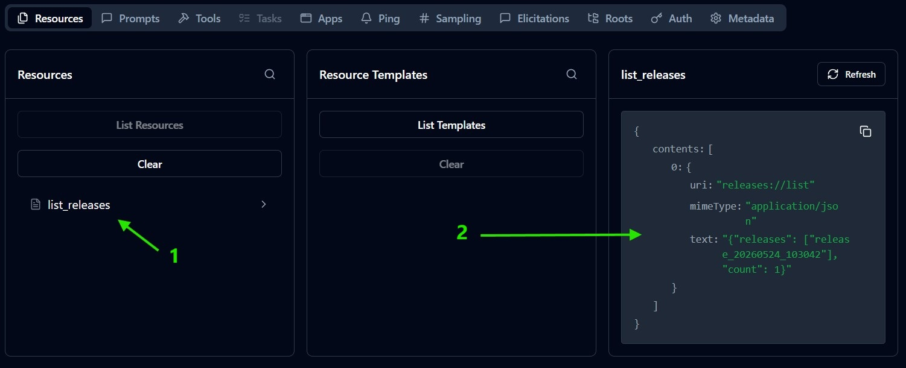

- **1)** `list_releases` — click to select and read
- **2)** Result on the right

```json
{
  "contents": [
    {
      "uri": "releases://list",
      "mimeType": "application/json",
      "text": "{\"releases\": [\"release_20260524_103042\"], \"count\": 1}"
    }
  ]
}
```

Notice the response structure: `uri`, `mimeType`, and `text`. The `text` field contains our JSON payload as a string — this is how MCP always wraps resource content.

✅ Static resource working correctly.

[⬆️ **`Part 5`**](#part-5)

---


### Test 2 — `releases://by/{id}` (Template Resource)

Switch to the **Resource Templates** section and click **List Templates**. You should see `get_release_by_id` appear below.

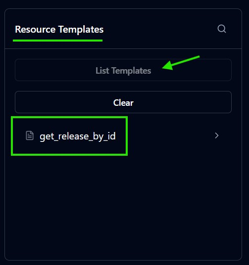

Click **`get_release_by_id`**, fill in the `id` parameter with a value from the list above, and click **Read Resource**.

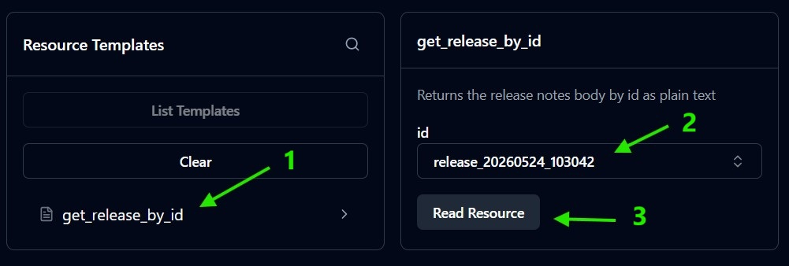

- **1)** `get_release_by_id` — click to select
- **2)** `id` field — paste the id from the previous result: `release_20260524_103042`
- **3)** **Read Resource** — click to execute

Result:

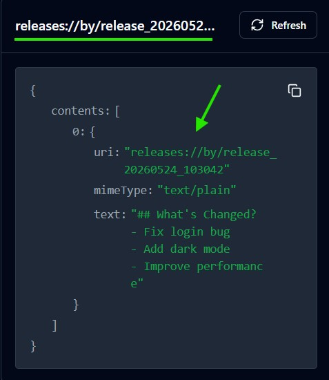

```json
{
  "contents": [
    {
      "uri": "releases://by/release_20260524_103042",
      "mimeType": "text/plain",
      "text": "## What's Changed? \n- Fix login bug\n- Add dark mode\n- Improve performance"
    }
  ]
}
```

Two things to observe here:

- The **URI** is now `releases://by/release_20260524_103042` — the `{id}` placeholder was resolved with the value we passed in.
- The **`mimeType`** is `text/plain` and the **`text`** is genuinely plain text — just the release notes body, no JSON wrapper. Compare this with Test 1 where `mimeType` was `application/json` and `text` contained a JSON string.

✅ Template resource working correctly.

[⬆️ **`Part 5`**](#part-5)

---


### What to keep in mind

> ⚠️ **MCP Inspector caching behaviour:** After calling a template resource (`releases://by/{id}`),
> the Inspector may return cached results for subsequent static resource calls (`releases://list`).
> Refresh the page to reset if you notice stale results.

> 💡 **The two resources are designed to chain:** use `releases://list` to discover available IDs, then `releases://by/{id}` to fetch the notes for a specific one. In our pipeline however, this flow is handled entirely by the `read_last_release()` tool — the resources exist here for exploration and demonstration purposes only.

❎ When you're done, press `Ctrl + C` in the terminal to stop the server.

---


> 💡 **MCP Curiosity**
> Template resources are a pattern unique to MCP — most APIs require you to know the full URL upfront. In MCP, a client can discover that `releases://by/{id}` exists, understand its parameter from the description, and construct the URI dynamically at runtime. The model can do the same.

[↑ Back to Table of Contents](#table-of-contents_)

<a name="part-6"></a>

---

## Part 06 — 🖥️✍️ Adding Prompts

#### ⚡ Quick Navigation: [⬅️ Part 05 — 🖥️📚🔍 Testing Resources](#part-5) | [Part 07 — 🖥️✍️🔍 Testing Prompts ➡️](#part-7)

> 📒 **What you'll learn:** How to define and register prompts in an MCP server — and why they're more powerful than they first appear.

---


### Theory

In MCP, a **Prompt** is a reusable message template that clients can retrieve and pass to an AI model as the starting point for a task.

Think of it like a **culinary recipe**: the ingredients are the parameters you pass in, and the recipe itself is the structured set of instructions that tells the AI exactly how to proceed — what role to adopt, what to produce, and how to format the result. Without the recipe, you might still end up with something edible. With it, you get a consistent, professional dish every time.

This is where the real value of MCP Prompts lies: **not just in the text itself, but in the instructions baked into it**. A well-crafted prompt template shapes the model's behaviour — defining its persona, framing the task, and guiding the output format — so every client that uses it gets the same quality result, without having to reinvent the prompt from scratch.

In practice, this means:

- Prompts live on the **server**, not scattered across client code
- Any client that connects can **discover and reuse** them via `prompts/list`
- Changing the prompt in one place **propagates everywhere** — no need to update each client

---


### Code walkthrough

> 📄 **File:** `MCP_Server/server_v4.py`

Prompts are registered with `@mcp.prompt()` — the same pattern as `@mcp.tool()` and `@mcp.resource()`.

```python
# ─────────────────────────────────────────────
# ✍️ PROMPT — template for generating release notes 
# ─────────────────────────────────────────────
@mcp.prompt()
def generate_release_notes(version: str, changes: str) -> str:
    """Prompt template to generate professional release notes."""
    return (f"""
You are a technical writer. Generate professional release notes for version {version}.

<Raw changes>
{changes}
</Raw changes>

Write clear, concise release notes suitable for a developer audience.
    """)
```

**`@mcp.prompt()`** — registers the function with the MCP server, making it discoverable via `prompts/list`.

**`version` and `changes`** — parameters injected into the template at call time. The client supplies these values when requesting the prompt.

**The docstring** — exposed to clients as the prompt description, just like with tools.

**The return value** — a fully formed string ready to be sent to the model. Notice it's not just a placeholder: it sets a **persona** (`You are a technical writer`), provides **context** (the raw changes), and defines the **expected output** (clear, concise, developer-focused). That's the recipe in action.

---


> 💡 **MCP Curiosity**  
> Prompts in MCP can include much more than plain strings — including images and embedded resources, allowing models to receive richer multimodal context directly inside the prompt.

[↑ Back to Table of Contents](#table-of-contents_)

<a name="part-7"></a>

---

## Part 07 — 🖥️✍️🔍 Testing Prompts

#### ⚡ Quick Navigation: [⬅️ Part 06 — 🖥️✍️ Adding Prompts](#part-6) | [Part 08 — 🔌 MCP Client Setup ➡️](#part-8)

> 📒 **What you'll learn:** How to test prompts in the MCP Inspector — and why what you see here is just the raw template, not the finished dish.

---


### Run it

```bash
mcp dev MCP_Server/server_v4.py
```

Open the URL shown in the terminal and connect:

- **Command** — `py` on Windows, `python` or `python3` on macOS/Linux
- **Arguments** — `MCP_Server/server_v4.py`
- Click **Connect**

---


### Navigate to Prompts

Once connected, click **Prompts** in the top navigation bar, then click **List Prompts** to fetch the prompts registered on your server.

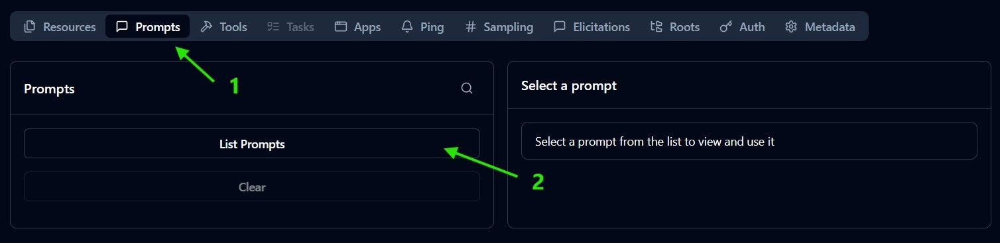

1) **Prompts** — click to open the prompts section
2) **List Prompts** — click to fetch registered prompts

---


### Select the prompt

After clicking **List Prompts**, `generate_release_notes` will appear. Click it to open the prompt form on the right.

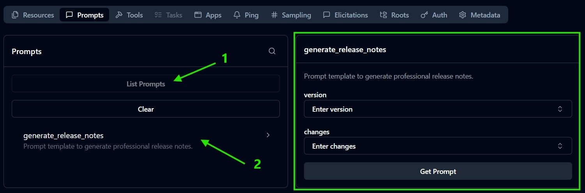

1) **List Prompts** — already clicked
2) **`generate_release_notes`** — click to select it; the parameter form appears on the right

---


### Fill in the parameters and run

Fill in the two parameters with any test values, then click **Get Prompt**.

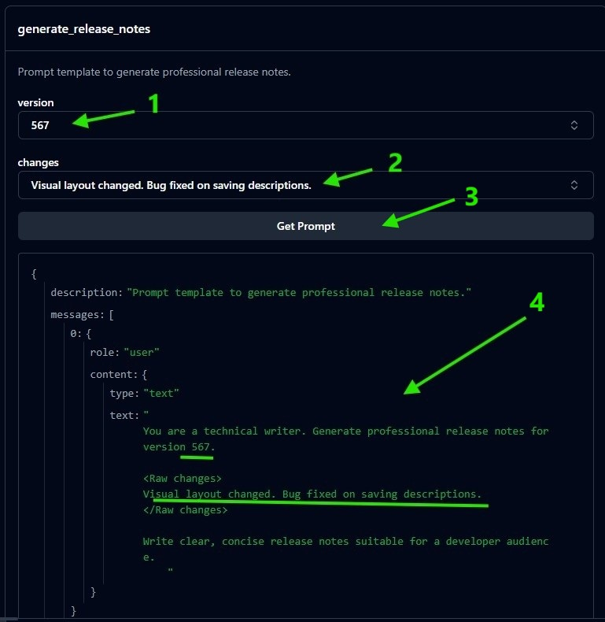

1) **`version`** — e.g. `567`
2) **`changes`** — e.g. `Visual layout changed. Bug fixed on saving descriptions.`
3) **Get Prompt** — click to execute

The result on the right shows the resolved prompt as a MCP message object:

```json
{
  "description": "Prompt template to generate professional release notes.",
  "messages": [
    {
      "role": "user",
      "content": {
        "type": "text",
        "text": "\nYou are a technical writer. Generate professional release notes for version 567.\n\n<Raw changes>\nVis..."
      }
    }
  ]
}
```

✅ Prompt retrieved and parameters correctly injected.

[⬆️ **`Part 7`**](#part-7)

---


### What you're actually seeing here

Not very exciting, right? And that's expected.

What the Inspector shows is just the **raw template with the parameters injected** — the recipe card, not the cooked meal. The model hasn't seen it yet. No release notes have been generated.

The real value kicks in when a client:
1. Calls `prompts/get` to retrieve this template
2. Passes it as the user message to the Claude API
3. Gets back a polished, professional release notes document

That's the pipeline we're building. The Inspector is just confirming the ingredient list is correct before we start cooking.

---


### What to keep in mind

> ⚠️ The MCP Inspector shows the prompt **before** it reaches a model — it's a static preview, not an AI completion. To see the output, you'd need to pass this message to the Claude API directly.

❎ When you're done, press `Ctrl + C` in the terminal to stop the server.

---


> 💡 **MCP Curiosity**
> Because prompts are server-side, they can be versioned, A/B tested, and updated without touching client code. In a multi-agent system, this means all agents automatically pick up prompt improvements the next time they call `prompts/get` — no redeploys needed on the client side.

---


### 🖥️ Server complete — what we built

Parts 01–07 covered the full MCP server. Before moving to the client, here's a quick recap of the three primitives and who actually calls them:

| Primitive | Decorator | Who calls it | Purpose |
|---|---|---|---|
| **Tool** | `@mcp.tool()` | The model — autonomously | Actions with side effects |
| **Resource** | `@mcp.resource()` | The MCP client / human | Read-only data access |
| **Prompt** | `@mcp.prompt()` | The MCP client / human | Reusable message templates |

> 💡 **Tools and error handling:** Because tools are called autonomously by the model, the errors they return are part of the model's context — it reads them. A descriptive error like `"Invalid version format: '1.2' does not match expected pattern 'v1.2.0'"` gives the model enough information to self-correct and retry `create_pdf` with the right value. Vague errors produce vague behaviour. The model reads your exceptions and can act accordingly!!! 🤯🤯🤯
>
> Resources and prompts don't share this property — their errors are returned to the client, not the model.


The server is a **capability provider** — it doesn't decide when or how its primitives are used. That intelligence lives on the other side.

Which brings us to Part 08. 👇

[↑ Back to Table of Contents](#table-of-contents_)

<a name="part-8"></a>

---

# 🔌MCP Client
## Part 08 — 🔌 MCP Client Setup

#### ⚡ Quick Navigation: [⬅️ Part 07 — 🖥️✍️🔍 Testing Prompts](#part-7) | [Part 09 — 🔌🔧🔍 Testing Tools ➡️](#part-9)

> 📒 **What you'll learn:** How to set up an MCP client from scratch — and how it connects to the server we built in Parts 01–07.

---


### Theory

So far, the server has been running in isolation — we tested it manually via the MCP Inspector.

Now we build the **client**: the component that connects to the server, discovers its capabilities, and exposes them to the AI model.

> 💡 **Recap from Part 01:** The server is a *capability provider* — it doesn't decide when or how its tools are used. The intelligence lives on the client side. The client is what bridges the server and the model.

---


### Wait — how does the server actually receive connections?

Before wiring up the client, there's a detail worth revisiting. Back in Part 01, we ended the server with:

> 📄 **File:** `MCP_Server/server_v1.py`

```python
if __name__ == "__main__":
    mcp.run()
```

This looked simple — but `mcp.run()` actually accepts a `transport` parameter:

```python
mcp.run(transport="stdio")  # this is the default
```

The full signature is:

```python
def run(
    transport: Literal['stdio', 'sse', 'streamable-http'] = "stdio",
    mount_path: str | None = None
) -> None
```

We didn't need to pass it explicitly because `"stdio"` is the default. But now that we're building the client, this matters: **our client needs to communicate over the same transport the server is listening on.**

Since the server uses `stdio` by default, the client will connect via stdio too — launching the server as a subprocess and communicating through its standard input/output streams.

> 💡 **Transport is just a detail — but it must match.** Client and server need to agree on the communication channel. In this project, both use `stdio`.

> ⚠️ **HTTP + SSE and StreamableHTTP** — The MCP ecosystem is evolving fast. You may encounter tutorials referencing `sse` as a transport option. As of MCP spec 2025-03-26, HTTP + SSE has been deprecated and replaced by `streamable-http`. If you're building a remote server, use `streamable-http` instead.

---


### Install dependencies

The server runs as a subprocess launched by the client — it inherits the same Python environment. If you followed Part 01, you already have everything you need.

If you're starting from a fresh `.venv` and don't need the MCP Inspector, the base package is enough:

```bash
pip install mcp
```

> 💡 `mcp[cli]` vs `mcp` — the `[cli]` extra installs the MCP Inspector tooling. The client doesn't use it, so the base package is sufficient. Both server and client primitives live in the same library.

---


### Code walkthrough

> 📄 **File:** `MCP_Client/client_v1.py`

#### Imports

```python
from contextlib import AsyncExitStack
from mcp import ClientSession, StdioServerParameters
from mcp.client.stdio import stdio_client
```

`AsyncExitStack` — manages multiple async resources and guarantees cleanup when the program ends, even if an error occurs. We'll come back to this below.

`ClientSession` — the high-level object that exposes `list_tools()`, `call_tool()`, `read_resource()`, `get_prompt()`, etc. This is what we'll use to talk to the server.

`StdioServerParameters` — defines how to launch the server subprocess (which command, which script).

`stdio_client` — opens the physical stdio communication channel with the server.

---


#### Configuration

```python
SERVER_SCRIPT = "MCP_Server/server_v4.py"
```

The path to the server file. The client will launch it as a subprocess.

[⬆️ **`Part 8`**](#part-8)

---


#### connect_to_mcp_server

This is the core function — it connects to the server and returns a `session` object ready to use.

```python
async def connect_to_mcp_server(exit_stack: AsyncExitStack) -> ClientSession:
    # Defines how to launch the MCP server as a subprocess (command + script path)
    mcp_server_params = StdioServerParameters(
        command="python",
        args=[SERVER_SCRIPT],
    )
    # Spawns the server subprocess and opens the stdio communication channel.
    # exit_stack registers it for automatic cleanup when the program ends.
    # What stdio_client returns: a tuple of two raw streams (read, write)
    stdio_transport = await exit_stack.enter_async_context(
        stdio_client(mcp_server_params)
    )
    read_stream, write_stream = stdio_transport

    # Wraps the raw streams into a high-level ClientSession object.
    # exit_stack registers it too — same pattern, different return value.
    # What ClientSession returns: the session itself — the object you actually use.
    # session exposes: list_tools(), call_tool(), read_resource(), get_prompt(), etc.
    session = await exit_stack.enter_async_context(
        ClientSession(read_stream, write_stream)
    )
    # Performs the MCP handshake — client and server exchange their capabilities
    await session.initialize()

    print("✅ Connected to MCP server\n")
    return session
```

Let's break it down step by step.

---


**Step 1 — StdioServerParameters**

```python
SERVER_SCRIPT = "MCP_Server/server_v4.py"

# (...)

mcp_server_params = StdioServerParameters(
    command="python",
    args=[SERVER_SCRIPT],
)
```

This is the recipe for launching the server. It says: *"run `python MCP_Server/server_v4.py` as a subprocess."*

Nothing has started yet — this is just configuration.

---


**Step 2 — stdio_client (the transport layer)**

```python
stdio_transport = await exit_stack.enter_async_context(
    stdio_client(mcp_server_params)
)
read_stream, write_stream = stdio_transport
```

This actually spawns the server subprocess and opens the communication channel.

`stdio_client` returns a tuple of two raw streams:
- `read_stream` — bytes coming *from* the server
- `write_stream` — bytes going *to* the server

Think of this as the **cable** connecting client and server. It's low-level — just bytes in and out.

> ⚠️ **Why `exit_stack.enter_async_context`?**
> This pattern registers the resource so it gets cleaned up automatically when the program ends. `enter_async_context` calls `__aenter__` to open the resource, and stores `__aexit__` to close it later — you don't have to manage that manually.
> 
> It appears twice here because we have **two separate resources** to manage: the transport (the subprocess + streams) and the session (the protocol layer on top). Each needs its own lifecycle.
>
> 🐇 **Want to go deeper on AsyncExitStack?** → [Asynchronous Context Managers — Medium](https://medium.com/@hitorunajp/asynchronous-context-managers-f1c33d38c9e3)

[⬆️ **`Part 8`**](#part-8)

---


**Step 3 — ClientSession (the protocol layer)**

```python
session = await exit_stack.enter_async_context(
    ClientSession(read_stream, write_stream)
)
await session.initialize()
```

`ClientSession` wraps the raw streams and adds the MCP protocol on top — it knows how to speak MCP, not just move bytes.

`session.initialize()` performs the MCP handshake: client and server exchange their capabilities (`tools/list`, `resources/list`, `prompts/list` metadata). After this step, the client knows what the server can do.
> 🔗 **Source:** [MCP Specification — Lifecycle](https://modelcontextprotocol.io/specification/2025-11-25/basic/lifecycle) | **Google Search**: "mcp specs lifecycle"
>
> 🐇 **Want to go deeper on what travels on the wire?**
> Under the hood, MCP uses JSON-RPC 2.0 — every `list_tools()`, `call_tool()`,
> or `get_prompt()` is serialised as a JSON-RPC request sent through the transport
> stream. FastMCP and ClientSession abstract this entirely, but if you inspect the
> raw stdio streams, you'll see messages like:
> ```json
> {"jsonrpc": "2.0", "method": "tools/call", "params": {"name": "read_last_release", "arguments": {}}, "id": 1}
> ```
> 🔗 [What is JSON-RPC 2.0: A Comprehensive Guide](https://www.a2aprotocol.org/en/docs/json-rpc-2-0) | **Google Search**: *"json-rpc 2.0 specification"*
>
> 
>
> So many terms — here's an analogy to tie them together:
>
> **stdio / streamableHTTP** → the communication channel. *How* they talk. stdio is face-to-face, in the same room (same machine). streamableHTTP is by phone, across a distance (separate servers).
>
> **JSON-RPC 2.0** → the language. *What tongue* they speak. English, French — here it's always JSON-RPC.
>
> **MCP** → the subject of the conversation. *What* they actually say. "What tools do you have?", "Run this tool", "Return this resource."


What you get back — `session` — is the object you'll use for everything from here on:

```python
session.list_tools()
session.call_tool(name, args)
session.read_resource(uri)
session.get_prompt(name, arguments)
```

> 💡 **Transport vs Session — the analogy:**
> The transport is the **cable**, the session is the **browser**. The browser needs the cable, but you only ever interact with the browser.

---


#### Entry point

```python
if __name__ == "__main__":
    pass
```

The client is set up but not doing anything yet — the connection logic is in place, and we'll add the actual calls in the next parts.

---


### What we built

A reusable `connect_to_mcp_server` function that:
1. Launches the MCP server as a subprocess
2. Opens a stdio communication channel
3. Wraps it in a `ClientSession` with full MCP protocol support
4. Returns a `session` ready to use

In Part 09, we'll use this session to call tools directly — no AI involved yet, just verifying the connection works end-to-end.

---


> 💡 **MCP Curiosity**
> The `stdio` transport is not limited to local processes — it's also how Claude Desktop connects to MCP servers configured in its `claude_desktop_config.json`. When you add a server to Claude Desktop, it launches it as a subprocess and communicates via stdio, exactly like we're doing here.
> 
> 🔗 **Source:** [Claude Desktop - Connect to local MCP servers](https://modelcontextprotocol.io/docs/develop/connect-local-servers)

[↑ Back to Table of Contents](#table-of-contents_)

<a name="part-9"></a>

---

## Part 09 — 🔌🔧🔍 Testing Tools

#### ⚡ Quick Navigation: [⬅️ Part 08 — 🔌 MCP Client Setup](#part-8) | [Part 10 — 🔌📚🔍 Testing Resources ➡️](#part-10)

> 📒 **What you'll learn:** How to call MCP tools directly from a Python client — no AI involved yet, just verifying the connection and tool calls work end-to-end.

---


### Theory

In Part 08 we built `connect_to_mcp_server` — a function that returns a `session` ready to use. Now we put it to work.

The goal here is simple: **call the two tools we built on the server and confirm they behave as expected.** This is the client equivalent of what we did in Part 03 with the MCP Inspector — except now we're doing it programmatically.

---


### Code walkthrough

> 📄 **File:** `MCP_Client/client_v2.py`

---


Before diving into MCP operations logic, there's a wrapper pattern worth understanding — 
it will repeat in Parts 10 to 13.

```python
import asyncio

# (...)

def test_tools():
    async def test_list_tools():
        async with AsyncExitStack() as stack:
            client_session = await connect_to_mcp_server(stack)
            # ... tool calls go here

    asyncio.run(test_list_tools())
```

Three things happening here:

**`async def test_list_tools()`** — the actual logic lives inside an async function
because MCP operations are async (they involve I/O: spawning a subprocess,
reading streams, waiting for responses).

**`async with AsyncExitStack() as stack`** — creates the exit stack and passes it
to `connect_to_mcp_server`. When the `async with` block ends — whether normally
or due to an error — the stack closes all registered resources automatically:
the session, the streams, the server subprocess.

**`asyncio.run(test_list_tools())`** — the outer `test_tools()` is a plain
synchronous function (our entry point). `asyncio.run()` is the bridge that
starts the event loop and runs the async logic inside it.

> 💡 This outer/inner pattern keeps the entry point synchronous (easy to call
> from `if __name__ == "__main__"`) while the actual work stays async.

---

Now let's see the test code, it is structured in three blocks:

---

#### Block 1 — List available tools

```python
list_tools_result = await client_session.list_tools()
tools = list_tools_result.tools

for idx, tool in enumerate(tools, start=1):
    print(f"{idx})  name: {tool.name} | description: {tool.description}")
```

Calls `session.list_tools()` — the client asks the server *"what tools do you expose?"* and gets back the full list with names and descriptions.

This is the same `tools/list` call the MCP Inspector uses under the hood.

---


#### Block 2 — Call `read_last_release`

```python
tool_name = "read_last_release"
read_last_release = await client_session.call_tool(tool_name)
print(read_last_release)
```

Calls the tool by name with no arguments — matches the server definition:

```python
@mcp.tool()
def read_last_release() -> dict:
    """Reads the most recent release payload from release_data/."""
```

---


#### Block 3 — Call `create_pdf`

```python
tool_name = "create_pdf"
tool_args = {
    'version'       : '444',
    'repo_name'     : 'a/repo/name',
    'release_notes' : 'Fix logging \n Fix backend \n Added button in frontend.',
    'published_at'  : '2026/05/28'
}
create_pdf = await client_session.call_tool(tool_name, tool_args)
print(create_pdf)
```

Here we pass arguments — and they map directly to the server-side function signature:

```python
@mcp.tool()
def create_pdf(version: str, repo_name: str, release_notes: str, published_at: str) -> dict:
```

The key names in `tool_args` must match the parameter names in the function. FastMCP handles the mapping automatically.

[⬆️ **`Part 9`**](#part-9)

---


### Run it

```python
if __name__ == "__main__":
    test_tools()
    pass
```

```bash
py MCP_Client/client_v2.py
```

Terminal output:

```
🔧  test_tools
✅ Connected to MCP server

Tools
-----------------------------------------------------------------
1)  name: read_last_release | description: Reads the most recent release payload from release_data/.
2)  name: create_pdf | description: Generates a PDF with the release notes.
-----------------------------------------------------------------

read_last_release call
-----------------------------------------------------------------
meta=None content=[TextContent(type='text', text='{"action": "published", ...}')] isError=False
-----------------------------------------------------------------

create_pdf call
-----------------------------------------------------------------
meta=None content=[TextContent(type='text', text='{"success": true, "file": "release_444_20260529_173135.pdf", ...}')] isError=False
-----------------------------------------------------------------
```

✅ Both tools called successfully via the MCP Client.

---


### Result — the generated PDF

The `create_pdf` call produced a real PDF in `MCP_Server/output/`:


```
Release Notes — a/repo/name
Version: 444
Published: 2026/05/28

Fix logging
Fix backend
Added button in frontend.
```

The `release_notes` string we passed in (`'Fix logging \n Fix backend \n Added button in frontend.'`) was split line by line and rendered as individual paragraphs by ReportLab — exactly as the `create_pdf` tool was built to do in Part 02.

---


### What to keep in mind

> ⚠️ At this stage the client is driving the tool calls manually — we decide what to call and with what arguments. In Part 12, the AI model takes over that decision entirely.

---


> 💡 **MCP Curiosity**
> `call_tool` returns a `CallToolResult` object — not just the raw output. It includes `content` (the tool's response), `isError` (whether the tool raised an exception), and `meta`. The model reads `isError` too — if a tool fails, it can decide to retry or adjust its approach.

[↑ Back to Table of Contents](#table-of-contents_)

<a name="part-10"></a>

---


## Part 10 — 🔌📚🔍 Testing Resources

#### ⚡ Quick Navigation: [⬅️ Part 09 — 🔌🔧🔍 Testing Tools](#part-9) | [Part 11 — 🔌✍️🔍 Testing Prompts ➡️](#part-11)

> 📒 **What you'll learn:** How to read static and template resources from a Python client — and why `read_resource` works the same for both.

---


### Theory

In Part 05 we tested resources manually via the MCP Inspector. Now we do the same programmatically.

The key difference from tools: resources split into **two separate lists** — static resources and template resources. They are discovered differently, but read the same way.

---


### Code walkthrough

> 📄 **File:** `MCP_Client/client_v3.py`

---

Before diving into the resource calls, one new import is required:

```python
from pydantic import AnyUrl
```

`AnyUrl` is used to pass a validated URI to `read_resource`. Without it, the client won't accept a plain string as a resource address.

---

Now let's see the test code, structured in two blocks:

---

#### Block 1 — Static Resources

```python
# List
list_resources_result = await client_session.list_resources()
for r in list_resources_result.resources:
    print(r)

# Read
result = await client_session.read_resource(AnyUrl("releases://list"))
print(result.contents[0].text)
```

Three steps:

**`client_session.list_resources()`** — asks the server for all static resources. Returns a result object.

**`.resources`** — the list of resource metadata objects (name, URI, description, mimeType).

**`client_session.read_resource(AnyUrl("releases://list"))`** — fetches the content of that specific resource by URI. The content lives in `result.contents[0].text`.

---

#### Block 2 — Template Resources

```python
# List
list_resource_templates_result = await client_session.list_resource_templates()
for r in list_resource_templates_result.resourceTemplates:
    print(r)

# Read
id = "release_20260524_103042"
uri = f"releases://by/{id}"
result_dynamic = await client_session.read_resource(AnyUrl(uri))
print(result_dynamic.contents[0].text)
```

Three steps:

**`client_session.list_resource_templates()`** — asks the server for all template resources. 🚨 Note this time around we didn't use `list_resources()`, we used `list_resource_templates()`.

**`.resourceTemplates`** — the list of template metadata objects (name, URI template, description, mimeType). 🚨 Again, `.resourceTemplates` NOT `.resources`.

**`client_session.read_resource(AnyUrl(uri))`** — same call as for static resources. The `{id}` placeholder in `releases://by/{id}` is resolved by constructing the full URI before passing it in. `read_resource` itself doesn't know or care whether the URI belongs to a static or template resource — it just fetches by address.

[⬆️ **`Part 10`**](#part-10)

---

### Run it

```python
if __name__ == "__main__":
    # test_tools()
    test_resources()
    pass
```

```bash
py MCP_Client/client_v3.py
```


Terminal output:

```
📚  test_resources
✅ Connected to MCP server

Static Resources
-----------------------------------------------------------------
name='list_releases' uri=AnyUrl('releases://list') description='Lists all available release IDs from release_data' mimeType='application/json' ...
-----------------------------------------------------------------

Static Resource result
-----------------------------------------------------------------
{"releases": ["release_20260524_103042"], "count": 1}
-----------------------------------------------------------------

Template Resources
-----------------------------------------------------------------
name='get_release_by_id' uriTemplate='releases://by/{id}' description='Returns the release notes body by id as plain text' mimeType='text/plain' ...
-----------------------------------------------------------------

Template Resource result for uri= releases://by/release_20260524_103042
-----------------------------------------------------------------
## What's Changed? 
- Fix login bug
- Add dark mode
- Improve performance
-----------------------------------------------------------------
```

✅ Both resource types read successfully via the Python client.

---

### Static vs Template — quick reference

| | Static Resource | Template Resource |
|---|---|---|
| **List method** | `list_resources()` | `list_resource_templates()` |
| **Access via** | `.resources` | `.resourceTemplates` |
| **URI** | Fixed — `releases://list` | Constructed — `releases://by/{id}` |
| **Read method** | `read_resource(AnyUrl(...))` | `read_resource(AnyUrl(...))` |

---

> 💡 **MCP Curiosity**
> MCP supports **dynamic tool discovery**: models can list and understand available capabilities in real-time, without pre-configuration.

[↑ Back to Table of Contents](#table-of-contents_)

<a name="part-11"></a>

---


## Part 11 — 🔌✍️🔍 Testing Prompts

#### ⚡ Quick Navigation: [⬅️ Part 10 — 🔌📚🔍 Testing Resources](#part-10) | [Part 12 — 🔌🤖 The AI Pipeline ➡️](#part-12)

> 📒 **What you'll learn:** How to list and retrieve prompts from a Python client — and what the rendered template actually looks like before it reaches a model.

---


### Theory

In Part 07 we tested prompts manually via the MCP Inspector. Now we do the same programmatically.

The flow is straightforward:
1. **Discover** — ask the server what prompts are available (`list_prompts`)
2. **Retrieve** — fetch a specific prompt with injected parameters (`get_prompt`)

Remember, no model is involved yet — this is just confirming the template is reachable and renders correctly.

---


### Code walkthrough

> 📄 **File:** `MCP_Client/client_v4.py`

The test is wrapped in the same outer/inner async pattern used in Parts 09 and 10 — `test_prompts()` as the sync entry point, `test_get_prompt()` as the async logic inside.

---

#### Block 1 — List available prompts

```python
list_prompts_result = await client_session.list_prompts()
prompts_list = list_prompts_result.prompts

for idx, prompt in enumerate(prompts_list, start=1):
    print(f"{idx}) name= {prompt.name} | description= {prompt.description} | arguments: {[x.name for x in prompt.arguments]}")
```

**`client_session.list_prompts()`** — asks the server *"what prompts do you expose?"*. Same discovery pattern as `list_tools()` and `list_resources()`.

**`.prompts`** — the list of prompt metadata objects. Each one exposes `name`, `description`, and `arguments` — a list of parameter objects, each with a `.name` attribute.

**`[x.name for x in prompt.arguments]`** — extracts just the parameter names into a clean list. This tells us exactly what arguments `get_prompt` will need.

---


#### Block 2 — Retrieve a specific prompt

```python
result = await client_session.get_prompt(
    "generate_release_notes",
    arguments={"version": "v1.0.0", "changes": "- Fixed bug\n- Added feature"}
)
print(result.messages[0].content.text)
```

**`client_session.get_prompt(name, arguments)`** — fetches the prompt template with the parameters injected. The `arguments` dict keys must match the parameter names discovered in Block 1.

**`result.messages[0].content.text`** — the rendered prompt string, ready to be passed to the Claude API as a user message. The `messages` structure mirrors what the API expects.

[⬆️ **`Part 11`**](#part-11)

---


### Run it

```python
if __name__ == "__main__":
    # test_tools()
    # test_resources()
    test_prompts()
    pass
```

```bash
py MCP_Client/client_v4.py
```

Terminal output:

```
✍️  test_prompts
✅ Connected to MCP server

Prompts
-----------------------------------------------------------------
1) name= generate_release_notes | description= Prompt template to generate professional release notes. | arguments: ['version', 'changes']
-----------------------------------------------------------------

Prompt text
-----------------------------------------------------------------

You are a technical writer. Generate professional release notes for version v1.0.0.

<Raw changes>
- Fixed bug
- Added feature
</Raw changes>

Write clear, concise release notes suitable for a developer audience.
    
-----------------------------------------------------------------
```

✅ Prompt listed and retrieved successfully via the Python client.

---


### Quick reference — Prompts vs Tools vs Resources

| | Tools | Resources | Prompts |
|---|---|---|---|
| **List method** | `list_tools()` | `list_resources()` / `list_resource_templates()` | `list_prompts()` |
| **Access via** | `.tools` | `.resources` / `.resourceTemplates` | `.prompts` |
| **Fetch method** | `call_tool(name, args)` | `read_resource(AnyUrl(...))` | `get_prompt(name, arguments)` |
| **Returns** | `CallToolResult` | `ReadResourceResult` | `GetPromptResult` |

---


### What to keep in mind

> ⚠️ `get_prompt` returns the **rendered template** — not a model completion. The parameters are injected, the string is built, but the model hasn't seen it yet. To generate actual release notes, you'd pass `result.messages` directly to the Claude API.

> 💡 **`result.messages` is already API-shaped.** The structure returned by `get_prompt` matches what the Claude API expects in `messages`.

---


> 💡 **MCP Curiosity**
> `list_prompts()`, `list_tools()`, and `list_resources()` all follow the same discovery pattern — the MCP protocol was designed so that a model can introspect any server's full capabilities at runtime, without prior knowledge. This is what makes MCP composable: connect to a new server, discover what it offers, and start using it — no hardcoding needed.

[↑ Back to Table of Contents](#table-of-contents_)

<a name="part-12"></a>

---

## Part 12 — 🔌🤖 The AI Pipeline

#### ⚡ Quick Navigation: [⬅️ Part 11 — 🔌✍️🔍 Testing Prompts](#part-11) | [Part 13 — 🔌🚀 Running the Pipeline ➡️](#part-13)

> 📒 **What you'll learn:** How to wire Claude into the MCP client — turning the manual tool calls and prompt fetches from the previous parts into a fully autonomous AI-driven pipeline.

---


### ⚠️ This part is dense — read carefully

Up to this point, *you* were the intelligence: you decided which tools to call, with what arguments, and in what order. From here on, **Claude decides**. The client's job shifts from "call tools" to "relay messages between Claude and the MCP server."

This is the biggest conceptual leap in the project. Take it step by step.

---


### 🎉 But also — this is the exciting part!

Everything we built so far — the MCP server, the tools, the resources, the prompts, the client connection — was laying the groundwork for this moment. We're about to plug the AI in and watch it drive. Let's go. 🚀

---


### Install dependencies

```bash
pip install anthropic python-dotenv
```

---

### Code walkthrough

> 📄 **File:** `MCP_Client/client_v5.py`

---


### New imports

```python
# Standard library
import json

# Anthropic
import anthropic

# Environment
import os
from dotenv import load_dotenv
load_dotenv()
```

`anthropic` — the official Python SDK for the Claude API.

`dotenv` — loads environment variables from a `.env` file so we don't hardcode the API key.

`json` — used to serialise tool inputs and results when logging.

[⬆️ **`Part 12`**](#part-12)

---


### Configuration  

```python
# ─────────────────────────────────────────────
# ⚙️ CONFIGURATION
# ─────────────────────────────────────────────
CLAUDE_MODEL      = "claude-haiku-4-5"
ANTHROPIC_API_KEY = os.getenv("ANTHROPIC_API_KEY")

assert ANTHROPIC_API_KEY, "Error: ANTHROPIC_API_KEY not found. Check your .env file."
```

`CLAUDE_MODEL` — the Claude model to use. We're using Haiku here for speed and cost efficiency.

`ANTHROPIC_API_KEY` — loaded from the environment. The `assert` fails fast with a clear message if the key is missing.

---


#### Setting up the `.env` file

You'll need an Anthropic API key → [console.anthropic.com](https://console.anthropic.com)

Create a `.env` file at the root of your project (a template is already provided as `.env.example`):

```
ANTHROPIC_API_KEY=sk-ant-your-key-here
```

> ⚠️ Never commit your `.env` file. Add it to `.gitignore`.

---


### The pipeline — `run_pipeline`

This is the core of Part 12. The function is structured in two phases: **setup** and **the tool use loop**.

---


#### Phase 1 — Setup

```python
messages = []

# - Get available tools
anthropic_tools = await get_tools_for_anthropic(client_session)
print(f"🔧 Tools available: {[t['name'] for t in anthropic_tools]}\n")

# - Get 'generate_release_notes' prompt
prompt_text = await get_prompt_for_release_notes(client_session, release_payload)
print(f"✍️  Prompt fetched ({len(prompt_text)} chars)\n")

# — Build initial message
initial_message = build_initial_message(release_payload, prompt_text)

messages.append({"role": "user", "content": initial_message})
```

Three helper functions do the prep work before Claude enters the picture:

---


##### `get_tools_for_anthropic`

```python
anthropic_tools = [
    {
        "name": t.name,
        "description": t.description,
        "input_schema": t.inputSchema,
    }
    for t in tools_result.tools
]
```

We already know how to list tools from the MCP server — we did it in Part 09. The difference here is the format: the Anthropic API expects tools as a list of dicts with `name`, `description`, and `input_schema`. This function fetches the tools from MCP and converts them into that shape. Claude will use this list to know what actions are available to it.

[⬆️ **`Part 12`**](#part-12)

---


##### `get_prompt_for_release_notes`

Also familiar from Part 11 — we call `get_prompt` on the MCP server. Here we inject the `tag_name` (version) and `body` (raw changes) from the release payload directly into the prompt template. The result is the fully rendered instructions that will guide Claude's writing style and tone.

> Remember this?
>
> 📄 **File:** `MCP_Server/server_v4.py`
```python
@mcp.prompt()
def generate_release_notes(version: str, changes: str) -> str:
    """Prompt template to generate professional release notes."""
    return (f"""
You are a technical writer. Generate professional release notes for version {version}.

<Raw changes>
{changes}
</Raw changes>

Write clear, concise release notes suitable for a developer audience.
    """)
```

---


##### `build_initial_message`

This function combines two things into a single user message:
- The **release payload** — so Claude knows what release to work with
- The **prompt instructions** — the professional writing guidelines fetched from the MCP server

The result is Claude's starting context: *"here's the release, here are your writing instructions, now get to work."*

That first message is appended to `messages` — the conversation history we'll maintain throughout the loop.

---


#### Phase 2 — The tool use loop

```python
anthropic_client = anthropic.Anthropic(api_key=ANTHROPIC_API_KEY)

while True:
    ...
```

`anthropic.Anthropic(api_key=...)` — creates the API client. This is the object that talks to the Claude API.

The `while True` loop is the agentic core: it runs until Claude decides it's done. Each iteration is one round of the conversation.

---


##### Step 1 — Send the message to Claude

```python
response = anthropic_client.messages.create(
    model=CLAUDE_MODEL,
    max_tokens=1024,
    tools=anthropic_tools,
    messages=messages,
)

messages.append({"role": "assistant", "content": response.content})
```

`model` — which Claude model to use. Defined in configuration as `"claude-haiku-4-5"`.

`max_tokens` — the maximum number of tokens Claude can produce in a single response. Set to `1024` here — enough for tool call decisions and a final summary, but not unbounded.

`tools` — the list of available tools we fetched from the MCP server and converted to Anthropic format. Passing this is what gives Claude the *ability* to call tools — without it, Claude can only produce text. When tools are present, Claude can choose to respond with a `tool_use` block instead of plain text.

`messages` — the full conversation history, in order. **This is critical.** Claude has no memory between API calls — every call is stateless from the API's perspective. The entire context must be sent every time: the initial user message, every tool call Claude made, every tool result we returned. If we only sent the latest message, Claude would have no idea what it already did or what it was trying to accomplish.

This is why we append to `messages` throughout the loop — we're manually building and maintaining the memory that Claude doesn't have natively.

The response is appended immediately as the assistant turn. This ensures that on the next iteration, Claude can see its own previous reasoning and tool requests as part of the conversation history.

[⬆️ **`Part 12`**](#part-12)

---

##### Step 2 — Check if Claude is done

```python
if response.stop_reason == "end_turn":
    final_text = next(
        (b.text for b in response.content if hasattr(b, "text")), "Done."
    )
    print(f"📍✅ Claude finished: {final_text}")
    break
```

`stop_reason == "end_turn"` means Claude has finished — it has no more tool calls to make and has produced its final response. We extract the last text block and break out of the loop.

If `stop_reason` is anything else (specifically `"tool_use"`), we continue to the next step.

---


##### Step 3 — Execute the tool calls

```python
tool_results = []
for block in response.content:
    if block.type == "tool_use":
        print(f"   🔧 Claude calls: {block.name}({json.dumps(block.input)})")
        result = await client_session.call_tool(block.name, block.input)
        result_text = result.content[0].text
        print(f"   ↳  Result: {result_text[:120]}...\n")
        tool_results.append({
            "type": "tool_result",
            "tool_use_id": block.id,
            "content": result_text,
        })

messages.append({"role": "user", "content": tool_results})
```

When `stop_reason == "tool_use"`, Claude's response contains one or more `tool_use` blocks. Each one says: *"call this tool, with these arguments."*

On behalf of Claude, the MCP client invokes each tool on the MCP server — exactly as we did manually in Part 09 — and collects the results.

Each result is packaged as a `tool_result` block and tied back to its originating `tool_use` block via `tool_use_id`. **This ID matters.** Here's a concrete example:

> Imagine that the MCP Server had a tool to sum two numbers!
>
> Claude receives: *"what is 3 + 4, and also 9 + 10?"*
>
> It produces two `tool_use` blocks — `add(3, 4)` with id `tool_abc`, and `add(9, 10)` with id `tool_xyz`.
>
> When we return the results, Claude needs to know that `7` belongs to `tool_abc` and `19` to `tool_xyz`. Without `tool_use_id`, Claude can't correlate results to requests — and the conversation breaks.

Once all results are collected, they're appended as a new `user` message and the loop restarts. Claude receives its own previous tool requests *and* the results, and decides what to do next: call more tools, or produce the final response.

[⬆️ **`Part 12`**](#part-12)

---

### Full flow — at a glance

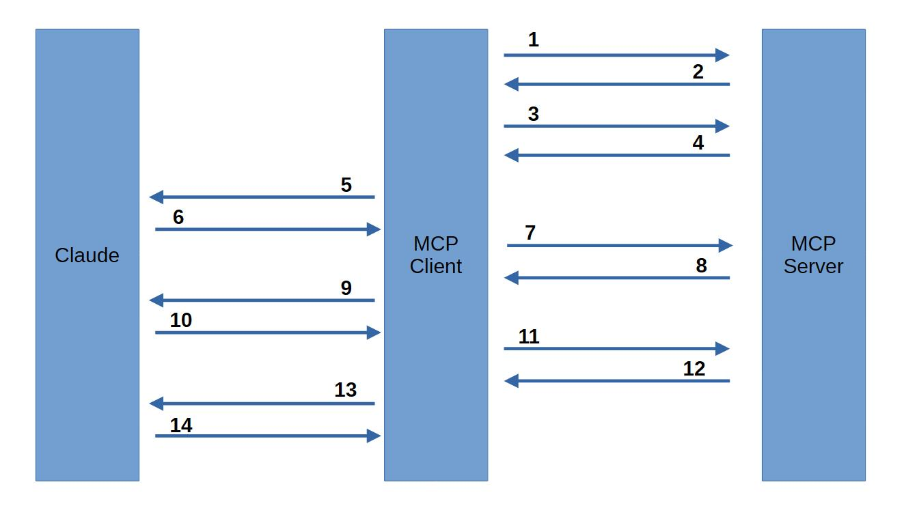

**⚙️ Setup**
> 🔌 1) MCP Client → MCP Server: *"what tools do you have?"*
>
> 💻 2) MCP Server → MCP Client: *[list of tools]*

```python
print(f"🔧 Tools available: {[t['name'] for t in anthropic_tools]}\n")
```

&nbsp;

> 🔌 3) MCP Client → MCP Server: *"give me the prompt template"*
>
> 💻 4) MCP Server → MCP Client: *[rendered prompt]*

```python
print(f"✍️  Prompt fetched ({len(prompt_text)} chars)\n")
```

&nbsp;

```python
print("🤖 Claude is working...\n")
```

**🔁 Tool Use Loop**
> 🔌 5) MCP Client → Claude API: *[tools + initial message]*
>
> 🤖 6) Claude API → MCP Client: *stop_reason: tool_use / tool: read_last_release*

```python
print(f"   🔧 Claude calls: read_last_release()")
```
&nbsp;

> 🔌 7) MCP Client → MCP Server: *call_tool("read_last_release")*
>
> 💻 8) MCP Server → MCP Client: *[tool_result]*

```python
print(f"   ↳  Result: ...\n")
```
&nbsp;

> 🔌 9) MCP Client → Claude API: *[full history + tool_result]*
>
> 🤖 10) Claude API → MCP Client: *stop_reason: tool_use / tool: create_pdf*

```python
print(f"   🔧 Claude calls: create_pdf({...})")
```
&nbsp;

> 🔌 11) MCP Client → MCP Server: *call_tool("create_pdf")*
>
> 💻 12) MCP Server → MCP Client: *[tool_result]*

```python
print(f"   ↳  Result: ...\n")
```
&nbsp;

> 🔌 13) MCP Client → Claude API: *[full history + tool_result]*
>
> 🤖 14) Claude API → MCP Client: *stop_reason: end_turn*

```python
print(f"📍✅ Claude finished: {final_text}")
```

---


### What to keep in mind

> ⚠️ Claude drives all tool decisions autonomously — the client doesn't tell it which tools to call or in what order. It infers the correct sequence from the task description and the available tool definitions. One thing to keep in mind: a highly detailed prompt like ours leaves little room for the model to reason — it's almost being told what to do step by step. Honestly? We're kind of cheating 😅 — `build_initial_message` hands Claude a numbered to-do list with the exact tools to call. Is that a problem? We'll find out in Part 13. 😎

> 💡 **The conversation history is the memory.** Claude has no state between API calls. The entire `messages` list is sent on every iteration — that's how it "remembers" what it already did.

---

### What's next?

The pipeline is wired. In Part 13 we run it for real — a sample release payload in, a polished PDF out. We'll also poke at `build_initial_message` and see what happens when we take the training wheels off. 👀

---


> 💡 **MCP Curiosity**
> The tool use loop we built here is the foundation of every agentic workflow. More complex agents follow the exact same pattern — the loop just runs longer, involves more tools, and may include branching logic based on tool results. The core mechanic is always: send → decide → execute → return → repeat.

[↑ Back to Table of Contents](#table-of-contents_)

<a name="part-13"></a>

---


## Part 13 — 🔌🚀 Running the Pipeline

#### ⚡ Quick Navigation: [⬅️ Part 12 — 🔌🤖 The AI Pipeline](#part-12) | [Part 14 — ⚡ FastAPI Webhook ➡️](#part-14)

> 📒 **What you'll learn:** How to run the full AI pipeline for the first time — observe the tool use loop in action, inspect the message metadata layer, and understand why tool descriptions are critical for the model.

---

### Theory

Up to Part 12 we wired everything together. Now we fire it up.

This part has three acts:

1. **Run the pipeline** — watch Claude call the tools autonomously and generate the PDF
2. **Enable debug mode** — inspect the raw message objects flowing through the conversation
3. **Break things on purpose** — remove tool descriptions and see what happens

---

### Code walkthrough

> 📄 **File:** `MCP_Client/client_v6.py`

Three changes from `client_v5.py`:

---

#### 1 — Import `DebugList`

```python
from helpers import DebugList
```

`DebugList` is a drop-in replacement for a regular Python list. Every time a message is appended, it pretty-prints its role and content blocks — making the conversation structure visible in the terminal.

> 💡 `DebugList` inherits from `list` and overrides `append`. The rest of the pipeline doesn't change at all.

---

#### 2 — Add the `DEBUG_PRINT_ALL_MESSAGE_DETAILS` flag

```python
async def run_pipeline(release_payload: dict, DEBUG_PRINT_ALL_MESSAGE_DETAILS = False):
    # (...)
    messages = DebugList() if DEBUG_PRINT_ALL_MESSAGE_DETAILS else []
```

When `True`, `messages` becomes a `DebugList`. When `False`, it's a plain list — no overhead.

---

#### 3 — Print `stop_reason` on every loop iteration

```python
while True:
    response = anthropic_client.messages.create(...)

    print(f"""    
___________________________________________
|
| 🛑 STOP REASON ==> {response.stop_reason}  
|__________________________________________\n""")

    messages.append({"role": "assistant", "content": response.content})
```

`stop_reason` is printed immediately after each API response, before anything else. This makes the loop's decision point visible in the terminal — you can see in real time whether Claude is requesting another tool call or wrapping up.

Two possible values in this pipeline:

| `stop_reason` | Meaning | Loop behaviour |
|---|---|---|
| `tool_use` | Claude wants to call a tool | Continue — execute tools, return results |
| `end_turn` | Claude is done | Break — extract final text, exit loop |

[⬆️ **`Part 13`**](#part-13)

---

#### 4 — Add `test_full_pipeline`

```python
def test_full_pipeline():
    sample_payload = {
        "action": "published",
        "release": {
            "tag_name": "v1.2.6760",
            "name": "Release v1.2.6760",
            "body": "## What's Changed?\n- Fix login bug\n- Add dark mode\n- Improve performance",
            "published_at": "2025-05-23T10:00:00Z",
            "html_url": "https://github.com/user/repo/releases/tag/v1.2.6760"
        },
        "repository": {
            "name": "mcp-release-notifier",
            "full_name": "user/mcp-release-notifier",
            "html_url": "https://github.com/user/mcp-release-notifier"
        }
    }
    asyncio.run(run_pipeline(sample_payload, False))
```

This simulates what the webhook will trigger in production — a complete release payload in, a polished PDF out. We start with debug **off** to keep the output clean.

```python
if __name__ == "__main__":
    # test_tools()
    # test_resources()
    # test_prompts()
    test_full_pipeline()
    pass
```

> ⚠️ Before running, open `MCP_Server/output/` in your file explorer — you'll want to see the PDF appear there after the pipeline finishes.

---

### Run 1 — Clean output (debug off)

```bash
py MCP_Client/client_v6.py
```

Terminal output:

```
✅ Connected to MCP server

🔧 Tools available: ['read_last_release', 'create_pdf']

✍️  Prompt fetched (266 chars)

🤖 Claude is working...

___________________________________________
|
| 🛑 STOP REASON ==> tool_use  
|__________________________________________

   🔧 Claude calls: read_last_release({})
   ↳  Result: {"action": "published", "release": {"tag_name": "v1.2.6760", ...

___________________________________________
|
| 🛑 STOP REASON ==> tool_use  
|__________________________________________

   🔧 Claude calls: create_pdf({"version": "v1.2.6760", "repo_name": "mcp-release-notifier", "release_notes": "..."})
   ↳  Result: {"success": true, "file": "release_v1.2.6760_20260531_170614.pdf", ...

___________________________________________
|
| 🛑 STOP REASON ==> end_turn  
|__________________________________________

📍✅ Claude finished: Perfect! I've successfully completed all three tasks...

✅ Pipeline complete.
```

Claude autonomously called `read_last_release`, wrote professional release notes, then called `create_pdf`. No manual orchestration — Claude decided the sequence.

[⬆️ **`Part 13`**](#part-13)

---

### 🎉 The WOW moment — the generated PDF

Three raw bullet points in:
```bash 
"body": "## What's Changed?\n- Fix login bug\n- Add dark mode\n- Improve performance" 
```
A structured, professional document out:

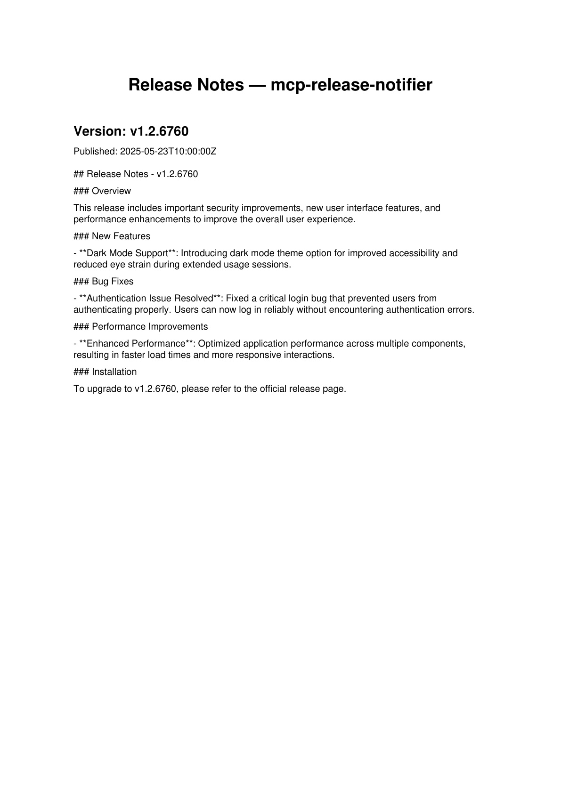

> Remember this?
>
> 📄 **File:** `MCP_Server/server_v4.py`
```python
@mcp.prompt()
def generate_release_notes(version: str, changes: str) -> str:
    """Prompt template to generate professional release notes."""
    return (f"""
You are a technical writer. Generate professional release notes for version {version}.

<Raw changes>
{changes}
</Raw changes>

Write clear, concise release notes suitable for a developer audience.
    """)
```

That's the prompt template doing its job — turning `"Fix login bug"` into a full paragraph. ✅

---

### Run 2 — Debug mode (metadata layer visible)

Now let's look under the hood. Change the flag in `test_full_pipeline`:

```python
asyncio.run(run_pipeline(sample_payload, True))
```

Run again:

```bash
py MCP_Client/client_v6.py
```

The terminal now shows every message object as it flows through the conversation. Here's what each one means:

[⬆️ **`Part 13`**](#part-13)

---

#### Message 1 — User (initial)

😎 **---->** 🤖
```
[METADATA LAYER] ─── Message Object ────────────────────────────────────
 ├── Role: USER 😎
 └── Content Blocks (Total: 1):
      ├── [Block Type]: Raw String Fallback
      └── [Payload]: A new GitHub release has been published...
```

The initial user message — release payload plus writing instructions. A single string block.

---

#### Message 2 — Assistant (first tool call)

😎 **<----** 🤖
```
___________________________________________
|
| 🛑 STOP REASON ==> tool_use  
|__________________________________________

[METADATA LAYER] ─── Message Object ────────────────────────────────────
 ├── Role: ASSISTANT 🤖
 └── Content Blocks (Total: 2):
      ├── [Block #0 Type]: TEXT
      │  └── [Preview]: "I'll help you process this GitHub release..."
      └── [Block #1 Type]: TOOL_USE
         ├── Tool Name: read_last_release
         ├── Execution ID: toolu_01JeLC5B3EuAJqF9Gbcgcis6
         └── Arguments Schema (JSON Input): {}
```

Claude responds with **two blocks**: a reasoning text block and a `tool_use` block. `stop_reason == "tool_use"` — the loop continues.
>🚨 Did you noticed that `Execution ID: toolu_01JeLC5B3EuAJqF9Gbcgcis6`? 🚨

---

#### Message 3 — User (tool result)

😎 **---->** 🤖
```
[METADATA LAYER] ─── Message Object ────────────────────────────────────
 ├── Role: USER 😎
 └── Content Blocks (Total: 1):
      └── [Block #0 Type]: TOOL_RESULT
         ├── Responding To ID: toolu_01JeLC5B3EuAJqF9Gbcgcis6
         └── Execution Output: {"action": "published", ...}
```

The client executes the tool and returns the result. **Responding To ID** matches the 🚨 `Execution ID` 🚨 from Message 2 — this is how Claude correlates results to requests.

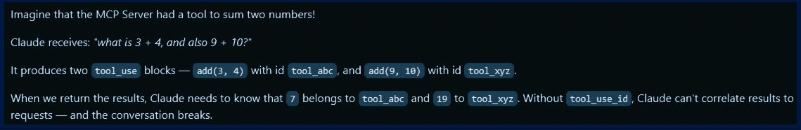

[⬆️ **`Part 13`**](#part-13)

---

#### Message 4 — Assistant (second tool call)

😎 **<----** 🤖
```
___________________________________________
|
| 🛑 STOP REASON ==> tool_use  
|__________________________________________

[METADATA LAYER] ─── Message Object ────────────────────────────────────
 ├── Role: ASSISTANT 🤖
 └── Content Blocks (Total: 2):
      ├── [Block #0 Type]: TEXT
      │  └── [Preview]: "Great! The release data has been confirmed. Now I'll create..."
      └── [Block #1 Type]: TOOL_USE
         ├── Tool Name: create_pdf
         ├── Execution ID: toolu_01N2srZnKD4oiiHVNHNbrPQ4
         └── Arguments Schema (JSON Input):
             {
               "version": "v1.2.6760",
               "repo_name": "mcp-release-notifier",
               "release_notes": "# Release Notes - v1.2.6760\n\n..."
             }
```

Claude "asks" MCP Client to call `create_pdf` with the **fully written release notes** already embedded in the arguments. The model wrote them — not us.

---

#### Message 5 — User (tool result)

😎 **---->** 🤖
```
[METADATA LAYER] ─── Message Object ────────────────────────────────────
 ├── Role: USER 😎
 └── Content Blocks (Total: 1):
      └── [Block #0 Type]: TOOL_RESULT
         ├── Responding To ID: toolu_01N2srZnKD4oiiHVNHNbrPQ4
         └── Execution Output: {"success": true, "file": "release_v1.2.6760_20260531_171604.pdf", ...}
```

PDF created. Result returned to Claude.

---

#### Message 6 — Assistant (end_turn)

😎 **<----** 🤖
```
___________________________________________
|
| 🛑 STOP REASON ==> end_turn  
|__________________________________________

[METADATA LAYER] ─── Message Object ────────────────────────────────────
 ├── Role: ASSISTANT 🤖
 └── Content Blocks (Total: 1):
      └── [Block #0 Type]: TEXT
         └── [Preview]: "Perfect! I've successfully completed all three tasks..."
```

`stop_reason == "end_turn"`. No more tool calls. The loop exits.

[⬆️ **`Part 13`**](#part-13)

---

### What the debug layer reveals

Six messages total. Every single one was included in the last API call. That's the stateless reality of LLM APIs: **the client maintains the full conversation history and sends it in its entirety on every request.**

Each iteration of the loop adds two messages — one assistant response and one user message with the tool results — and the next call carries everything accumulated so far. Claude can only "remember" what we explicitly send back to it. And this is not optional — imagine a tool that depends on the output of a previous one: if the `read_last_release` result isn't in the history, Claude has no way to pass the correct version or repo name to `create_pdf`. Drop a `tool_result` from the list and the chain breaks.

Look at this line in the pipeline:

```python
response = anthropic_client.messages.create(
    model=CLAUDE_MODEL,
    max_tokens=1024,
    tools=anthropic_tools,
    messages=messages,   # 👈 THE ENTIRE HISTORY, EVERY TIME
)
```

`messages` is not "the latest message". It's the full list — growing with every iteration:

```
Iteration 1  →  messages = [msg_1]
Iteration 2  →  messages = [msg_1, msg_2, msg_3]
Iteration 3  →  messages = [msg_1, msg_2, msg_3, msg_4, msg_5]
```

By the time Claude produces its final `end_turn` response, the API call carries all 6 messages. Claude reads the entire conversation from scratch on every call — there is no server-side session, no hidden state, no memory outside of what you send. This is also why long conversations with any LLM — ChatGPT, Claude, Gemini — feel slower and less reliable over time: every reply re-processes the entire history, and as the context grows, so does latency, cost, and the probability of the model losing the thread.

> 💡 **The conversation history is the memory.** Strip any message from the list and Claude loses that context permanently. The `messages` list *is* the mind of the agent.

---
# NOW THE FUN PART 😎😎😎


### Experiments — what happens when we loosen the instructions?

> 📄 **File:** `MCP_Client/client_v6_test.py`

So far our prompt was very explicit — it gave Claude a numbered to-do list with the exact tools to call, in order. Let's see what happens when we take the training wheels off.

---

#### The change — `build_initial_message_test`

Instead of:

```python
Your task:
1. Call read_last_release to confirm the release data.
2. Using the instructions below, write professional release notes for this release.
3. Call create_pdf with the professional release notes you wrote.
```

We give it something more open:

```python
Your task:
Get the last release and write something professional about it, include that in a pdf!
```

Same tools available. Same prompt template. Just a looser task description.

---

#### Run it

We also change the `body` in `test_full_pipeline_v2` to make it easy to spot which release was actually used:

```python
"body": "## What's Changed?\n- Fix button 'send'\n- Add dark mode\n- Improve performance",
```

```bash
py MCP_Client/client_v6_test.py
```

---

#### Result — Claude parallelises the tool calls

Here's Message 2 from the debug output:

```
___________________________________________
|
| 🛑 STOP REASON ==> tool_use  
|__________________________________________

[METADATA LAYER] ─── Message Object ────────────────────────────────────
 ├── Role: ASSISTANT 🤖
 └── Content Blocks (Total: 3):
      ├── [Block #0 Type]: TEXT
      │  └── [Preview]: "I'll help you generate professional release notes and create a PDF. Let me st..."
      ├── [Block #1 Type]: TOOL_USE
      │  ├── Tool Name: read_last_release
      │  ├── Execution ID: toolu_01U27obfKVzmhet6RuNy9xVz
      │  └── Arguments Schema (JSON Input): {}
      └── [Block #2 Type]: TOOL_USE
         ├── Tool Name: create_pdf
         ├── Execution ID: toolu_0147hk94Kmy3f8gwfPDKKLYv
         └── Arguments Schema (JSON Input):
             {
               "version": "v1.2.6760",
               "repo_name": "mcp-release-notifier",
               "release_notes": "# Release v1.2.6760 - Release Notes\n\n..."
             }
```

**Three content blocks in a single assistant message** — one TEXT and two TOOL_USE. Claude decided to call both tools at the same time, in parallel.

Without step-by-step instructions, Claude reasoned: *"I have everything I need from the payload — I don't need to wait for `read_last_release` to start writing."* So it wrote the release notes immediately and fired both tool calls in one shot.

And Message 3 reflects that — two TOOL_RESULT blocks side by side:

```
[METADATA LAYER] ─── Message Object ────────────────────────────────────
 ├── Role: USER 😎
 └── Content Blocks (Total: 2):
      ├── [Block #0 Type]: TOOL_RESULT
      │  ├── Responding To ID: toolu_01U27obfKVzmhet6RuNy9xVz
      │  └── Execution Output: {"action": "published", ...}
      └── [Block #1 Type]: TOOL_RESULT
         ├── Responding To ID: toolu_0147hk94Kmy3f8gwfPDKKLYv
         └── Execution Output: {"success": true, "file": "release_v1.2.6760_20260601_152312.pdf", ...}
```

The full conversation collapsed from 6 messages to 4. One fewer round-trip to the API.

[⬆️ **`Part 13`**](#part-13)

---

#### What this reveals about Claude's reasoning

| | Step-by-step prompt | Open prompt |
|---|---|---|
| **Tool call pattern** | Sequential — one per iteration | Parallel — both in one response |
| **Total messages** | 6 | 4 |
| **API round-trips** | 3 | 2 |
| **PDF content** | Based on `read_last_release` result | Based on payload already in context |

> ⚠️ **Notice the trade-off.** In the parallel run, Claude used the release data from the initial payload — not the file on disk. It didn't wait for `read_last_release` to confirm anything. In this project that's fine, but in a real pipeline where the file on disk could differ from the payload, the sequential approach is safer.

> 💡 **The prompt shapes the behaviour.** A numbered task list forces sequential execution. A free-form instruction lets Claude optimise on its own — which may be faster, but less predictable. Neither is wrong; it depends on what guarantees your pipeline needs.

---

#### The loop ran once less — and that matters

In the step-by-step version the loop ran 3 times (tool_use → tool_use → end_turn). Here it ran twice (tool_use → end_turn). Each iteration is a full API call — latency, tokens billed, round-trip to the model.

When tool calls are **independent** — meaning neither needs the result of the other — you can execute them in parallel: spin up two threads, each resolves one tool, both results come back at the same time. Faster and cheaper.

In this specific case though, parallelising is a problem in disguise. Both tool calls appear together in Message 2 — meaning Claude already decided what to write in the PDF **before** `read_last_release` even ran. The release notes were composed using the data in the payload, not the confirmed data from disk. It worked here because both matched. But if the file on disk had different content, Claude would have no idea — it had already committed to the PDF content before seeing the result.

> ⚠️ **Parallel is faster. Sequential is safer.** When tool calls have a dependency — where one needs the output of another — sequential execution is the right call. The step-by-step prompt enforces that. The open prompt leaves it up to Claude — and Claude optimises for speed.

> 🐇 **Want to go deeper?** Ask an AI: *"What is parallel tool use in the Anthropic API and how does it affect agentic pipeline design?"*

---

### 🔨 Your turn — break things

The best way to understand how Claude uses tools is to make it struggle. Here are some experiments to try on your own:

**On the server (`server_v4.py`):**
- **Vague the descriptions** — remove the docstrings from `read_last_release` and `create_pdf`, or replace them with something generic like `"does stuff"`. Does Claude still know when to call them?
- **Add a decoy tool** — create a third tool called `fetch_release_data` with a description similar to `read_last_release` but pointing to a different file. Which one does Claude pick?
- **Add two conflicting tools** — two tools that sound like they do the same thing but behave differently. Watch Claude reason about which one to use.
- **Break a tool's output** — make `read_last_release` return an empty dict or malformed JSON. Does Claude recover, ask for clarification, or loop forever?

**On the client (`client_v6.py`):**
- **Pass an empty tools list** — set `anthropic_tools = []`. Claude has no tools available — what does it do instead?
- **Pass only one tool** — give Claude `create_pdf` but not `read_last_release`. How does it adapt?

> 💡 There are no right answers here — the point is to observe. Every experiment reveals something about how Claude reasons with tools, and that intuition is worth more than any explanation.

---

> 💡 **MCP Curiosity**
> The `tool_use_id` / `tool_result` pairing is part of the Anthropic Messages API spec, not MCP. MCP returns the execution result; the client wraps it in the correct API format. This separation — MCP handles tool execution, the Anthropic SDK handles conversation structure — is what makes the architecture composable.

[↑ Back to Table of Contents](#table-of-contents_)

<a name="part-14"></a>

---

# ⚡ Webhook

## Part 14 — ⚡ FastAPI Webhook

#### ⚡ Quick Navigation: [⬅️ Part 13 — 🔌🚀 Running the Pipeline](#part-13) | [Part 15 — 🌐 Cloudflared ➡️](#part-15)

> 📒 **What you'll learn:** How to expose the pipeline through a FastAPI webhook — so any GitHub release event can trigger it automatically, without running anything manually.

---


### Install dependencies

```bash
pip install fastapi uvicorn
```

---


### Code walkthrough

> 📄 **File:** `FastAPI_Webhook/webhook_v1.py`

The webhook is a FastAPI app with two endpoints: a health check and the main `/webhook` route that receives GitHub events.

---

#### Configuration & setup

```python
import sys
from pathlib import Path

# 1. Allow Python to see other folders in the project
sys.path.append(str(Path(__file__).parent.parent))

RELEASE_DATA_DIR = Path(__file__).parent.parent / "MCP_Server" / "release_data"
RELEASE_DATA_DIR.mkdir(exist_ok=True)

# 2. Now we can safely import from MCP_Client
sys.path.append(str(Path(__file__).parent.parent / "MCP_Client")) 
from MCP_Client.client_v6 import run_pipeline 

# FOR TEST PURPOSES
PIPELINE_IS_ACTIVE = False
```
`sys.path.append(...)` — This is a little Python trick. Since our FastAPI server lives in `FastAPI_Webhook/` and the pipeline code lives in `MCP_Client/`, Python wouldn't normally find the import and would throw a `ModuleNotFoundError`. By adding the root project folder to `sys.path`, we tell Python: ***"Hey, if you can't find a module here, check the sibling folders too!"***

`RELEASE_DATA_DIR` — points to the same `release_data/` folder the MCP server reads from. Payloads are saved here so `read_last_release` can find them.

`run_pipeline` — the pipeline function we built in Part 12/13. The webhook imports it directly.

`PIPELINE_IS_ACTIVE` — a toggle for testing. When `False`, the webhook accepts and validates requests without triggering the pipeline.

---

#### Health check

```python
@app.get("/health")
def health():
    return {"status": "ok"}
```

A simple sanity check. Useful to confirm the server is up before testing the main route.

---

#### The webhook endpoint

```python
@app.post("/webhook")
async def github_webhook(
    request: Request,
    x_github_event: str = Header(default=""),
    body: GitHubWebhookPayload = None
    ):
```

Three things to note:

**`request: Request`** — gives us access to the raw HTTP request (headers, body). This is what the webhook actually needs to function.

**`x_github_event` and `body`** — these two parameters are **not required** for the webhook to work. They exist solely to make Swagger (at `http://localhost:8000/docs`) render the header field and the request body as fillable fields, making manual testing much easier. Without them, Swagger would show a bare endpoint with no inputs.

**`GitHubWebhookPayload`** — a Pydantic model with `extra = "allow"`. This lets Swagger display a structured body while accepting any additional fields GitHub might include.

[⬆️ **`Part 14`**](#part-14)

---

#### Webhook logic — step by step

```python
# 1. Parse body
payload = await request.json()

# 2. Filter — only care about releases
event_type = request.headers.get("X-GitHub-Event", "")
if event_type != "release":
    return JSONResponse({"ignored": True, "reason": ...})

# 3. Filter — only 'published' action
action = payload.get("action", "")
if action != "published":
    return JSONResponse({"ignored": True, "reason": ...})

if PIPELINE_IS_ACTIVE:
    # 4. Save payload to release_data
    (RELEASE_DATA_DIR / filename).write_text(json.dumps(payload, indent=2))

    # 5. Fire the pipeline
    asyncio.create_task(run_pipeline(payload))

return JSONResponse({"received": True, "tag": payload["release"]["tag_name"]})
```

The logic is deliberately simple:
- Parse the JSON body
- Ignore anything that isn't a `release` event with action `published`
- Save the payload to disk (so the MCP server can read it)
- Fire the pipeline as a background task via `asyncio.create_task` — the webhook returns immediately without waiting for it to complete

> 💡 `asyncio.create_task` is key here. The pipeline takes several seconds (multiple Claude API calls). Without it, GitHub's webhook delivery would time out waiting for a response.

---


### Run it

```bash
py .\FastAPI_Webhook\webhook_v1.py
```

Terminal output:

```
INFO:     Will watch for changes in these directories: [...]
INFO:     Uvicorn running on http://0.0.0.0:8000 (Press CTRL+C to quit)
INFO:     Started reloader process [16408] using StatReload
INFO:     Started server process [3132]
INFO:     Waiting for application startup.
INFO:     Application startup complete.
```

The server is live on port 8000. Open `http://localhost:8000/docs` in your browser to access the Swagger UI.

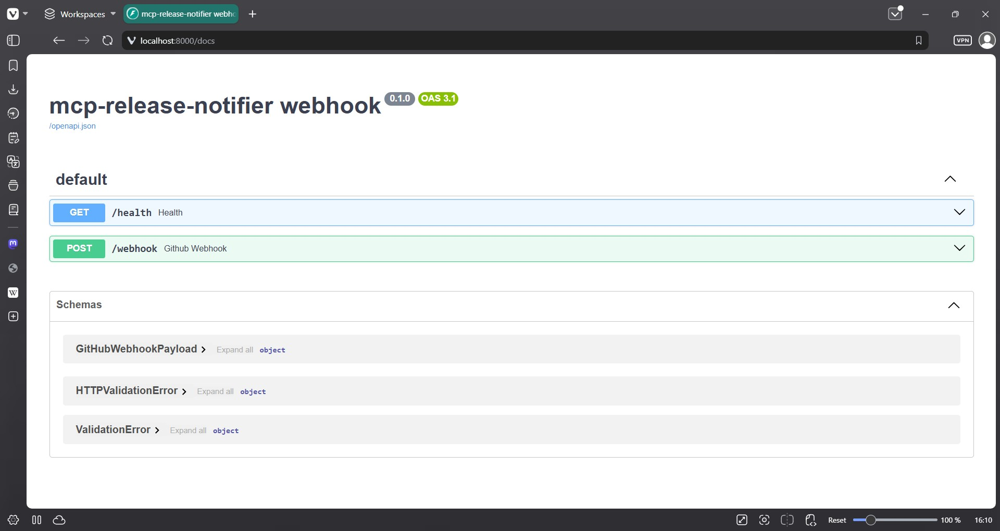

[⬆️ **`Part 14`**](#part-14)

---


### Test 1 — Health check

In Swagger, expand the `GET /health` endpoint:

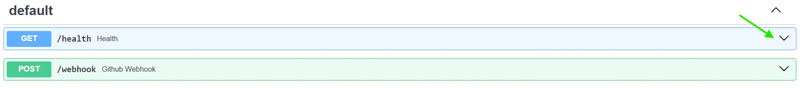

1) Arrow → click **▶ /health** to expand it

Click **Try it out**:

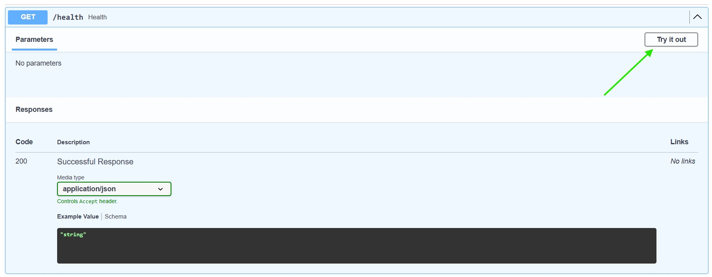

2) Arrow → **Try it out** button

Click **Execute**:

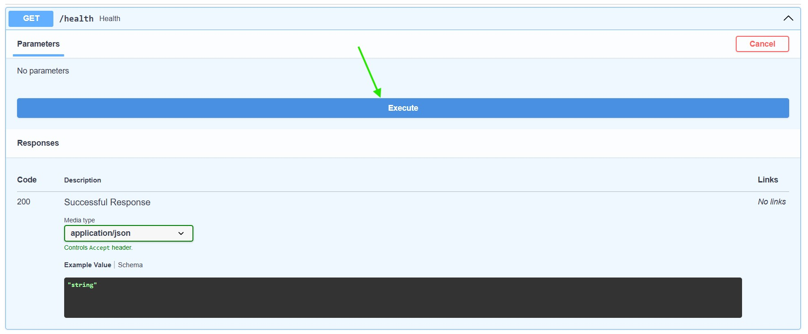

3) Arrow → **Execute** button

Result:

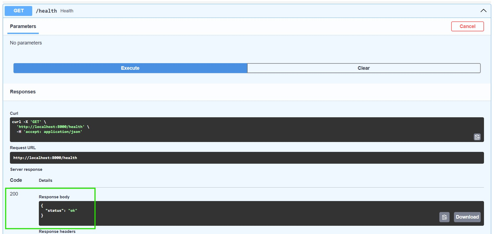

```json
{
  "status": "ok"
}
```

Terminal confirms the request was received:

```
INFO:     Application startup complete.
INFO:     127.0.0.1:63300 - "GET /docs HTTP/1.1" 200 OK
INFO:     127.0.0.1:63300 - "GET /openapi.json HTTP/1.1" 200 OK
INFO:     127.0.0.1:55066 - "GET /health HTTP/1.1" 200 OK
```

✅ Server is running correctly.

[⬆️ **`Part 14`**](#part-14)

---


### Test 2 — Webhook (pipeline off)

Before triggering the full pipeline, let's confirm the webhook route works correctly. Make sure `PIPELINE_IS_ACTIVE = False` in the code.

Expand `POST /webhook`, then click **Try it out**.

Notice the two fields that appear — they're there because of the `x_github_event` and `body` parameters in the function signature:

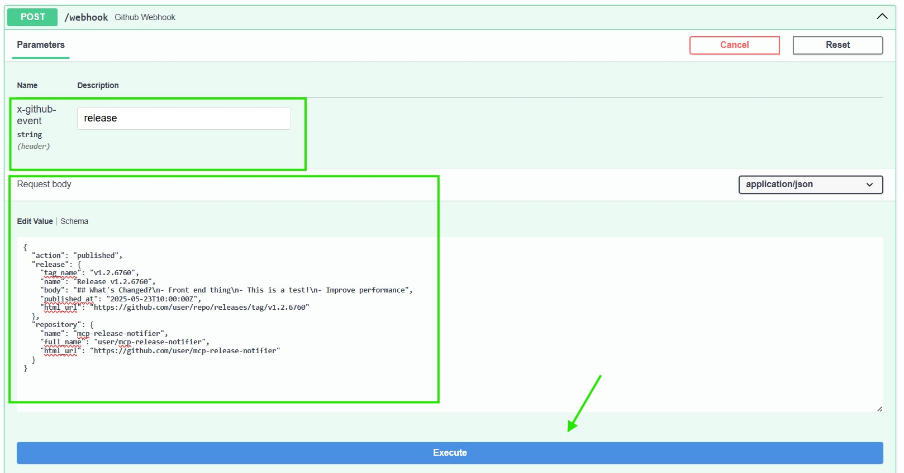

Fill them in:

**`x-github-event`** → `release`

**Request body:**
```json
{
  "action": "published",
  "release": {
    "tag_name": "v1.2.6760",
    "name": "Release v1.2.6760",
    "body": "## What's Changed?\n- Front end thing\n- This is a test!\n- Improve performance",
    "published_at": "2025-05-23T10:00:00Z",
    "html_url": "https://github.com/user/repo/releases/tag/v1.2.6760"
  },
  "repository": {
    "name": "mcp-release-notifier",
    "full_name": "user/mcp-release-notifier",
    "html_url": "https://github.com/user/mcp-release-notifier"
  }
}
```

Click **Execute**.

Result:

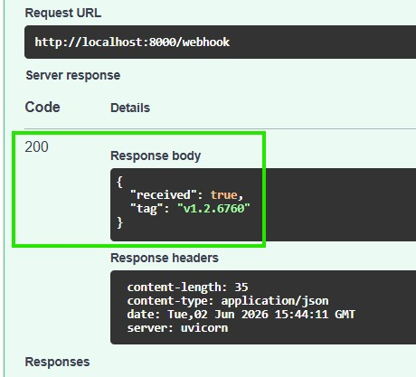

```json
{
  "received": true,
  "tag": "v1.2.6760"
}
```

✅ Webhook received and validated the payload correctly.

[⬆️ **`Part 14`**](#part-14)

---


### Test 3 — Full pipeline (pipeline on)

Now let's fire the real thing.

**Step 1** — In `webhook_v1.py`, set `PIPELINE_IS_ACTIVE = True` and save:

```python
# FOR TEST PURPOSES
PIPELINE_IS_ACTIVE = True
```

> ⚠️ The server uses `reload=True` — it will pick up the change automatically.

**Step 2** — Keep an eye on:
- `MCP_Server/release_data/` — a new JSON file should appear
- `MCP_Server/output/` — a new PDF should appear
- The terminal — Claude's tool use loop will print there

**Step 3** — Click **Execute** again in Swagger (same payload as Test 2).

---

A new JSON is saved to `release_data/`:

```json
{
  "action": "published",
  "release": {
    "tag_name": "v1.2.6760",
    ...
  }
}
```

A new PDF appears in `output/`:

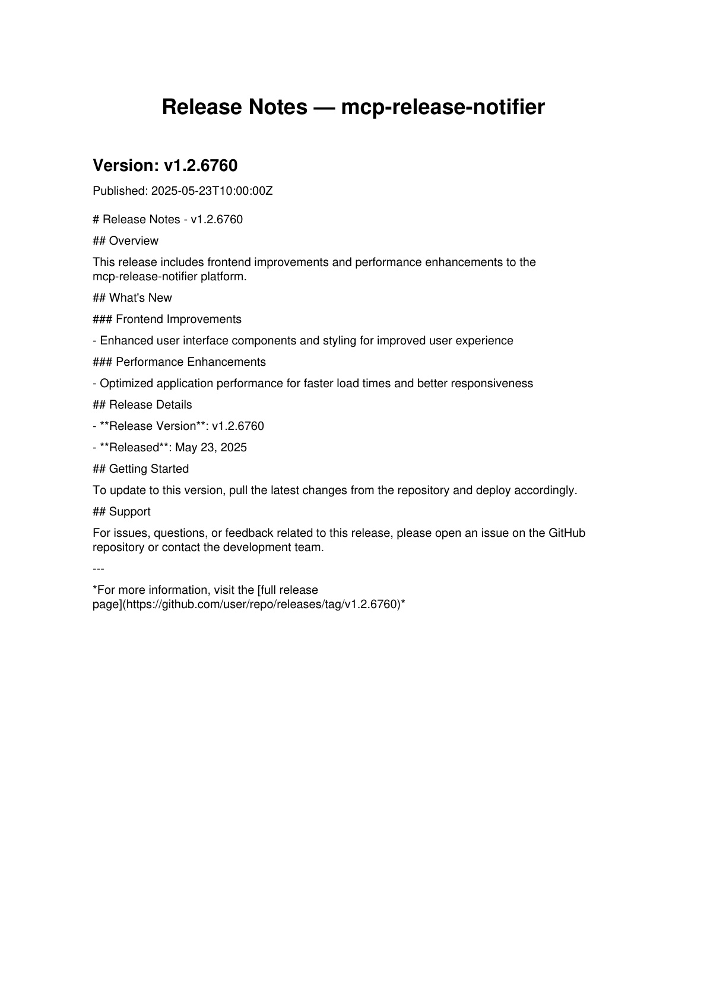

And the terminal shows the full pipeline run:

```
💾 Saved payload to release_data/release_20260602_165207.json
🚀 Release received: v1.2.6760 — triggering pipeline...
INFO:     127.0.0.1:56864 - "POST /webhook HTTP/1.1" 200 OK
✅ Connected to MCP server

🔧 Tools available: ['read_last_release', 'create_pdf']

✍️  Prompt fetched (270 chars)

🤖 Claude is working...

___________________________________________
|
| 🛑 STOP REASON ==> tool_use  
|__________________________________________

   🔧 Claude calls: read_last_release({})
   ↳  Result: {"action": "published", "release": {"tag_name": "v1.2.6760", ...

___________________________________________
|
| 🛑 STOP REASON ==> tool_use  
|__________________________________________

   🔧 Claude calls: create_pdf({"version": "v1.2.6760", "repo_name": "mcp-release-notifier", "release_notes": "..."})
   ↳  Result: {"success": true, "file": "release_v1.2.6760_20260602_165213.pdf", ...

___________________________________________
|
| 🛑 STOP REASON ==> end_turn  
|__________________________________________

📍✅ Claude finished: Perfect! I've successfully completed all the tasks...

✅ Pipeline complete.
```

Notice the HTTP 200 was returned **before** the pipeline finished — that's `asyncio.create_task` doing its job. The webhook responded instantly; Claude kept working in the background.

✅ Full pipeline triggered via webhook. End to end. 🎉

[⬆️ **`Part 14`**](#part-14)

---


### What to keep in mind

> ⚠️ `asyncio.create_task` fires the pipeline without awaiting it — if the process exits before the task finishes, the pipeline is lost. In other words if the server restarts before the pipeline is finished, everything will be lost! Try fire the pipeline and kill the server right away, no PDF will be generated! For production, a proper task queue (Celery, ARQ, or similar) would be more reliable.

> 💡 **The `x_github_event` / `body` parameters are Swagger helpers only.** In production, GitHub sends the `X-GitHub-Event` header automatically and you read it from `request.headers`. The Pydantic `body` parameter exists purely so Swagger renders a fillable form — remove both in production if you want a clean signature.

❎ When you're done, press `Ctrl + C` in the terminal to stop the server.

---

> 💡 **MCP Curiosity**
> In a production setup, you'd also verify the `X-Hub-Signature-256` header GitHub includes with every webhook delivery. It's an HMAC-SHA256 signature of the payload using a secret you configure in GitHub — validating it ensures the request actually came from GitHub and wasn't spoofed. We will do that in the following parts! 👇

[↑ Back to Table of Contents](#table-of-contents_)

<a name="part-15"></a>

---


## Part 15 — 🌐 Cloudflared

#### ⚡ Quick Navigation: [⬅️ Part 14 — ⚡ FastAPI Webhook](#part-14) | [Part 16 — 🐙 GitHub Webhook ➡️](#part-16)

> 📒 **What you'll learn:** How to expose your local webhook server to the internet using Cloudflare Tunnel — so GitHub can reach it in Part 16.

---


### Theory

Right now, your webhook server is running on `http://localhost:8000`. That's great for local testing via Swagger — but GitHub lives on the internet, and it can't reach your `localhost`.

**Cloudflare Tunnel** solves this. It creates a secure, outbound-only connection from your machine to Cloudflare's global network. The result: a public HTTPS URL that forwards all traffic directly to your local server — no open ports, no firewall changes, no public IP required.

```
GitHub
   │
   ▼
https://your-tunnel.trycloudflare.com   ← public URL (Cloudflare's edge)
   │
   ▼ (secure outbound tunnel)
http://localhost:8000                    ← your machine
```

The tool that creates and manages this tunnel is called `cloudflared` — a lightweight CLI daemon you install once and run alongside your server.

> 💡 **Why not ngrok?** Both tools do the same job. Cloudflare Tunnel is free, has no session time limits, and requires no account for Quick Tunnels. It's the better default for this project.

> ⚠️ **Quick Tunnels vs Named Tunnels:**
> We're using a **Quick Tunnel** — zero config, no Cloudflare account needed. The trade-off: the URL is random and changes every time you restart the tunnel. For development that's fine; for production you'd set up a Named Tunnel with a fixed custom domain.

---


### Step 1 — Install cloudflared

#### Windows
```bash
winget install Cloudflare.cloudflared
```

#### macOS
```bash
brew install cloudflare/cloudflare/cloudflared
```

#### Linux (Debian / Ubuntu)
```bash
curl -L --output cloudflared.deb https://github.com/cloudflare/cloudflared/releases/latest/download/cloudflared-linux-amd64.deb
sudo dpkg -i cloudflared.deb
```

After installing on **any OS**: close the terminal and open a new one so the `cloudflared` binary is available in your PATH.

---


### Step 2 — Verify the installation

```bash
cloudflared --version
```

You should see something like:

```
cloudflared version 2026.5.0
```

✅ Ready to tunnel.

---


### Step 3 — Start the FastAPI server

First make sure `PIPELINE_IS_ACTIVE = True` in `webhook_v1.py`, then in the terminal, run:

```bash
py .\FastAPI_Webhook\webhook_v1.py
```

Terminal output:
```
INFO:     Uvicorn running on http://0.0.0.0:8000
INFO:     Application startup complete.
```

Keep this terminal open.

[⬆️ **`Part 15`**](#part-15)

---


### Step 4 — Create the tunnel

Open a **second terminal** (keep the first one running) and run:

```bash
cloudflared tunnel --url http://localhost:8000
```

After a few seconds you'll see something similar to this:

```
INF +--------------------------------------------------------------------------------------------+
INF |  Your quick Tunnel has been created! Visit it at (it may take some time to be reachable):  |
INF |  https://rocky-screen-temperature-polo.trycloudflare.com                                   |
INF +--------------------------------------------------------------------------------------------+
```

Your public URL is the `trycloudflare.com` address. Copy it — you'll need it in a moment.

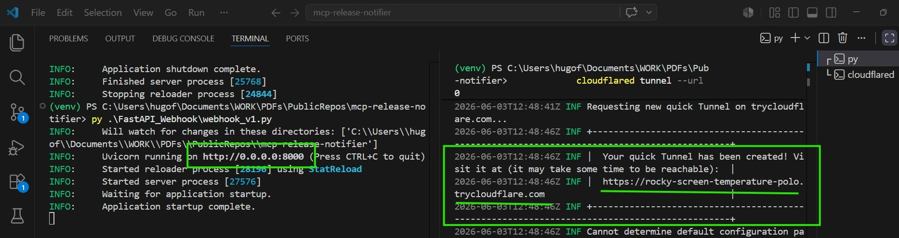

> ⚠️ This URL is **temporary**. It changes every time you restart the tunnel. In Part 16 you'll paste it into GitHub — if you restart cloudflared, you'll need to update GitHub's webhook URL too.

> 💡 The long log output after the URL is just diagnostic info — connection protocol (`quic`), Cloudflare edge location (`mad05`), connector ID, etc. The only line that matters for this part is the `trycloudflare.com` URL.

---


### Step 5 — Open Swagger via the public URL

In your browser, open:

```
https://<your-address>.trycloudflare.com/docs
```

For me it was:

```
https://rocky-screen-temperature-polo.trycloudflare.com/docs
```

> ⚠️ Don't forget the `/docs` at the end — the root URL returns nothing, Swagger lives at `/docs`.

You should see the exact same Swagger UI you used in Part 14 — but now accessible from anywhere on the internet.

---


### Step 6 — Test the full pipeline through the tunnel

In Swagger, expand `POST /webhook` → **Try it out** and fill in:

**`x-github-event`**: `release`

**Request body:**
```json
{
  "action": "published",
  "release": {
    "tag_name": "v1.2.6760",
    "name": "Release v1.2.6760",
    "body": "## What's Changed?\n- Front end thing\n- Cloudflared!\n- Improve performance",
    "published_at": "2025-05-23T10:00:00Z",
    "html_url": "https://github.com/user/repo/releases/tag/v1.2.6760"
  },
  "repository": {
    "name": "mcp-release-notifier",
    "full_name": "user/mcp-release-notifier",
    "html_url": "https://github.com/user/mcp-release-notifier"
  }
}
```

> Note that in the "body": there is a "Cloudflared!". I added so we can spot the difference!

Keep an eye on `MCP_Server/release_data/` and `MCP_Server/output/` — a new JSON and a new PDF should appear.

Click **Execute**.

[⬆️ **`Part 15`**](#part-15)

---


### Step 7 — Verify the result

The webhook returns `{"received": true, "tag": "v1.2.6760"}` and the pipeline runs in the background. Check `MCP_Server/output/` — the new PDF should contain the text from the `body` field above, including "Cloudflared!".

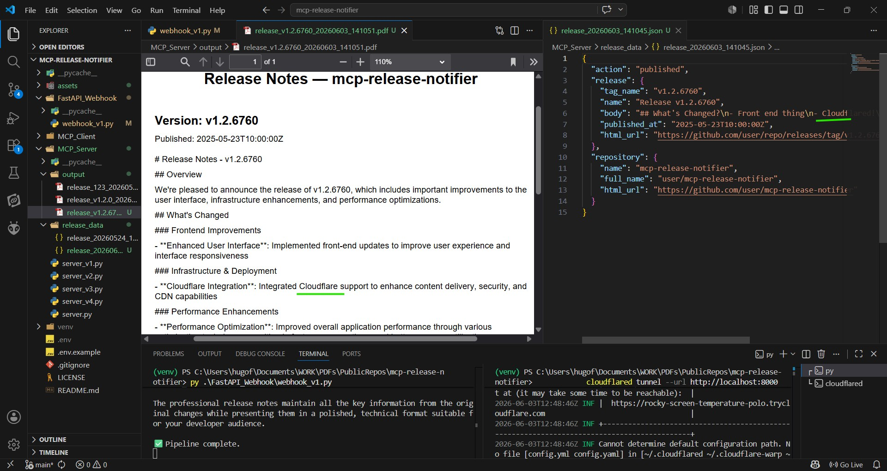

✅ Your local webhook is now reachable from the public internet. Next we will make GitHub talk to it.

---


### What to keep in mind

> ⚠️ The **URL changes on every restart**. Whenever you stop and restart `cloudflared`, you get a new random URL — and you'll need to update the GitHub webhook URL in Part 16 to match.

> ⚠️ Keep **both terminals open** for the rest of this part of the project: one for the FastAPI server, one for cloudflared. Closing either one breaks the connection.

> 💡 **The tunnel is outbound-only.** Your machine never opens an inbound port. All traffic flows: internet → Cloudflare edge → outbound tunnel → your `localhost`. That's what makes it safe even on a home network.

❎ When you're done experimenting, press `Ctrl + C` in both terminals to stop the server and the tunnel.

---


> 💡 **MCP Curiosity**
> Cloudflare Tunnel uses the **QUIC protocol** by default (you can see `protocol=quic` in the log output). QUIC is the same transport protocol underneath HTTP/3 — it reduces connection latency compared to TCP, which matters when your tunnel is relaying webhook payloads to a pipeline that fires multiple Claude API calls in sequence.

[↑ Back to Table of Contents](#table-of-contents_)

<a name="part-16"></a>

---


## Part 16 — 🐙 GitHub Webhook

#### ⚡ Quick Navigation: [⬅️ Part 15 — 🌐 Cloudflared](#part-15) | [Part 17 — 🔗 Full Pipeline ➡️](#part-17)

> 📒 **What you'll learn:** How to register a GitHub webhook that sends release events to your local server — closing the loop between a real GitHub release and the pipeline we built.

---


### Before you start

Make sure both terminals from Part 15 are still running:

- **Terminal 1** — FastAPI server (`py .\FastAPI_Webhook\webhook_v1.py`)
- **Terminal 2** — Cloudflare Tunnel (`cloudflared tunnel --url http://localhost:8000`)

You'll need the `trycloudflare.com` URL from Terminal 2 — copy it now.

> ⚠️ **The tunnel URL changes every time you restart `cloudflared`.** If you stopped and restarted it since Part 15, you have a new URL. You'll need to update the webhook URL in GitHub to match — we'll cover that at the end of this part.

---


### Step 1 — Open your repository Settings

Navigate to any GitHub repository you control (or create a new one called `test`). In the top horizontal menu, click **Settings**.

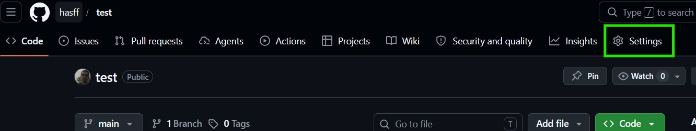

---


### Step 2 — Navigate to Webhooks

In the left sidebar, click **Webhooks**.

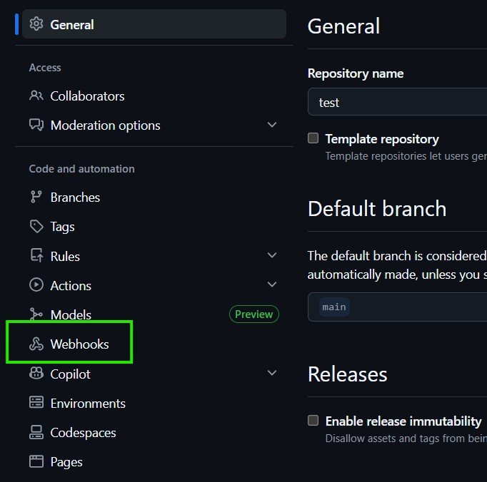

> 💡 **GitHub may ask you to confirm your identity** before accessing this section — it will send a verification code to your email. This is normal; just follow the prompts.

[⬆️ **`Part 16`**](#part-16)

---


### Step 3 — Add a new webhook

On the Webhooks page, click **Add webhook**.

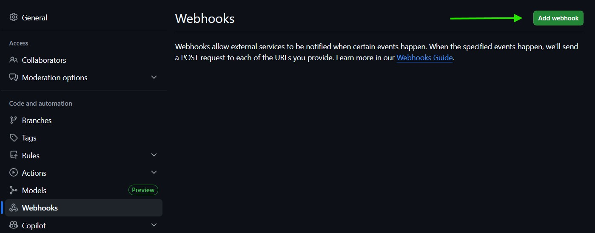

---


### Step 4 — Fill in the webhook configuration

You'll land on the webhook creation form. Fill in the four fields highlighted below:

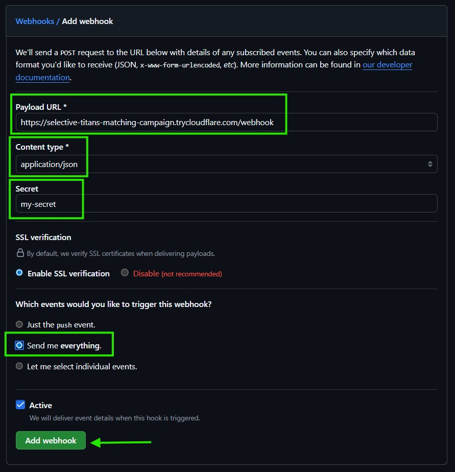

| Field | Value |
|---|---|
| **Payload URL** | `https://<your-address>.trycloudflare.com/webhook` |
| **Content type** | `application/json` |
| **Secret** | a string of your choice (e.g. `my-secret`) |
| **Which events?** | `Send me everything` |

A few things to note:

**Payload URL** — your tunnel URL from Part 15 with `/webhook` appended. It must match your FastAPI endpoint exactly. In my case it was `https://selective-titans-matching-campaign.trycloudflare.com/webhook` — yours will be different.

**Content type** — set to `application/json`. GitHub will send the payload as JSON in the request body, which is what our webhook expects.

**Secret** — the value GitHub will use to sign every webhook delivery with an HMAC-SHA256 signature. Write it down — you'll need it in the next part when we add signature verification. In production, use something long and random; 🚨 `my-secret` is for demo purposes only.

**Send me everything** — fine for development. In production, I recommend you to use **"Let me select individual events"** and select only `Releases` — no reason to hit your server with events it will immediately ignore.

Click **Add webhook**.

[⬆️ **`Part 16`**](#part-16)

---


### Step 5 — Webhook created

GitHub confirms the webhook was registered successfully.

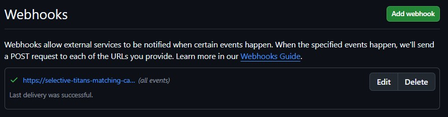

✅ GitHub will now send a POST request to your tunnel URL every time a release event is published on this repository.

---


### What to keep in mind

> ⚠️ **If you restart `cloudflared`**, your tunnel URL changes. Come back to this Settings page, edit the webhook, and paste the new URL into the **Payload URL** field.

> ⚠️ **The Secret you entered here** will be needed in Part 17 when we add `webhook_v2.py` and enable signature verification. Don't lose it.

> 💡 GitHub sends a **ping event** immediately after you add a webhook — a test delivery to confirm the endpoint is reachable. If your server is running and the tunnel is up, you'll see a `200 OK` under the webhook settings page → **Recent Deliveries**.

---


> 💡 **MCP Curiosity**
> GitHub webhooks use HMAC-SHA256 signatures — the same cryptographic primitive used to sign JWT tokens and AWS request payloads. The server computes the expected signature from the secret and the raw request body, then compares it to the one GitHub sent. If they match, the request is authentic. In Part 17 we'll implement this in `webhook_v2.py`.


[↑ Back to Table of Contents](#table-of-contents_)

<a name="part-17"></a>

---


# 🔗 Full Pipeline
## Part 17 — 🔗 Full Pipeline

#### ⚡ Quick Navigation: [⬅️ Part 16 — 🐙 GitHub Webhook](#part-16) | [Part 18 — 🎮 Discord Setup ➡️](#part-18)

> 📒 **What you'll learn:** How to put everything together — secure the webhook with a GitHub signature, trigger a real release from GitHub, and watch the full pipeline run end to end.

---


### Theory

In Part 14 we built the webhook and tested it manually via Swagger. In Parts 15 and 16 we exposed it to the internet and wired it to GitHub. Now we close the loop: a real GitHub release fires the webhook, which triggers the pipeline, which generates the PDF.

One thing is missing before we can do that safely — **signature verification**. Without it, anyone who knows your webhook URL could send fake payloads. GitHub signs every request it sends using a shared secret; we need to validate that signature before trusting the payload.

That's what `webhook_v2.py` adds.

---


### Code walkthrough

> 📄 **File:** `FastAPI_Webhook/webhook_v2.py`

---

#### 1 — New imports

```python
import hashlib
import hmac
import os
```

`hashlib` and `hmac` — used together to compute and compare HMAC-SHA256 signatures. `os` — to read the secret from the environment.

---

#### 2 — Loading the secret

```python
WEBHOOK_SECRET = os.environ["GITHUB_WEBHOOK_SECRET"]
```

The secret is loaded from the environment, not hardcoded. You need to add it to your `.env` file:

```
ANTHROPIC_API_KEY=sk-ant-your-key-here
GITHUB_WEBHOOK_SECRET=your-secret-here
```

> ⚠️ Use the same secret you set in GitHub when configuring the webhook in Part 16. It can be any string — just keep it consistent on both sides.

---

#### 3 — Signature verification function

```python
def verify_signature(payload_body: bytes, signature_header: str) -> bool:
    if not signature_header:
        return False
    
    expected_signature = "sha256=" + hmac.new(
        WEBHOOK_SECRET.encode("utf-8"),
        payload_body,
        hashlib.sha256,
    ).hexdigest()

    return hmac.compare_digest(expected_signature, signature_header)
```

GitHub computes an HMAC-SHA256 of the raw request body using your secret, and sends it in the `X-Hub-Signature-256` header formatted as `sha256=<hex>`.

We compute the same hash on our side and compare using `hmac.compare_digest` — a constant-time comparison that prevents timing attacks.

> 💡 **Why `hmac.compare_digest` and not `==`?** A regular string comparison short-circuits as soon as it finds a mismatch — an attacker can measure response time to guess the signature one character at a time. `compare_digest` always takes the same time regardless of where the mismatch is.

[⬆️ **`Part 17`**](#part-17)

---

#### 4 — Step 0 in `github_webhook` — Verify Signature

```python
@app.post("/webhook")
async def github_webhook(request: Request):

    # ── 0. Verify Signature ────────────────────────
    body = await request.body()
    signature = request.headers.get("X-Hub-Signature-256")

    if not verify_signature(body, signature):
        raise HTTPException(status_code=401, detail="Invalid signature")
    
    # ... rest of the handler
```

This is the first thing the endpoint does — before parsing JSON, before filtering events. If the signature doesn't match, the request is rejected with a `401`.

> ⚠️ Note that we read `request.body()` here — raw bytes — not `request.json()`. The signature is computed over the raw body; parsing it to JSON first would change the bytes and break the comparison.

---

#### 5 — Swagger helpers removed

Compared to `webhook_v1.py`, the `x_github_event` and `body` parameters are gone from the function signature:

```python
# webhook_v1.py
async def github_webhook(
    request: Request,
    x_github_event: str = Header(default=""),
    body: GitHubWebhookPayload = None
    ):

# webhook_v2.py
async def github_webhook(request: Request):
```

Those parameters existed only to render fillable fields in Swagger for manual testing. Since we're now receiving real GitHub events — and the signature check means we can't easily simulate requests through Swagger anyway — they're no longer needed.

---

### Switch to `webhook_v2.py`

**Step 1** — Stop the server that's running `webhook_v1.py` (`Ctrl + C` in that terminal).

**Step 2** — Start `webhook_v2.py`:

```bash
py FastAPI_Webhook/webhook_v2.py
```

> ⚠️ **Do NOT stop cloudflared.** The public URL is already registered in GitHub from Part 16. If you stop cloudflared, you'll get a new random URL and will need to either edit the existing webhook in GitHub's settings or create a new one. Leave that terminal running.

[⬆️ **`Part 17`**](#part-17)

---


### Trigger a real GitHub release

Everything is running. Time to fire a real release.

---

#### Step 1 — Go to your repository

Open your GitHub repository. On the right side column you'll see a **Releases** section. Click **Create a new release**.

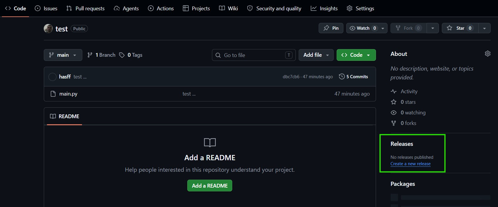

---

#### Step 2 — Fill in the release details

On the **New release** screen, fill in:

- **Tag** — e.g. `v1.3.0` (create a new tag or pick an existing one)
- **Release title** — e.g. `Release v1.3.0`
- **Release notes** — describe what changed; this is the raw content the AI will transform into a professional document

When you're done, click **Publish release**.

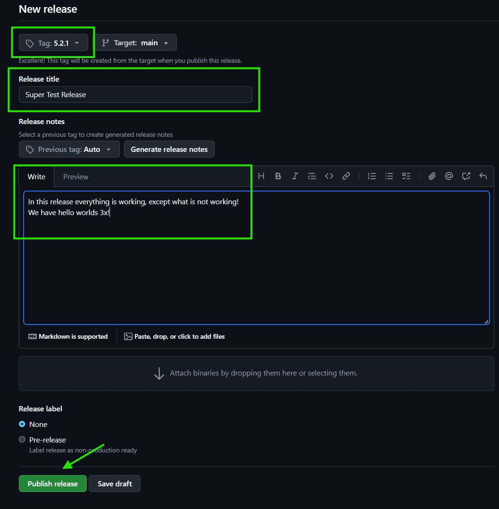

[⬆️ **`Part 17`**](#part-17)

---

#### Step 3 — Confirm the release was created

GitHub will redirect you to the release page. The release is now live.

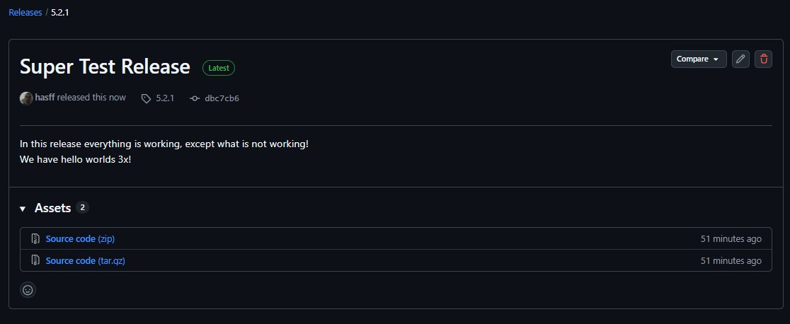

---


### Watch the pipeline run

Switch to your terminal — you'll see the webhook receive the payload and the pipeline kick off.

---

#### Terminal — pipeline triggered

The webhook saves the payload and Claude starts working:

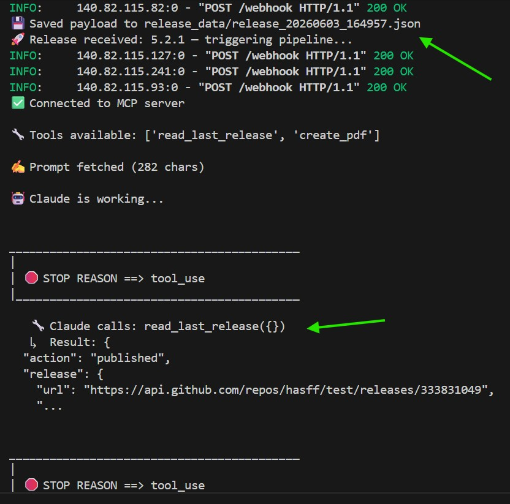

```
💾 Saved payload to release_data/release_20260602_183021.json
🚀 Release received: v1.3.0 — triggering pipeline...
INFO:     ... "POST /webhook HTTP/1.1" 200 OK
✅ Connected to MCP server

🔧 Tools available: ['read_last_release', 'create_pdf']

✍️  Prompt fetched (270 chars)

🤖 Claude is working...

___________________________________________
|
| 🛑 STOP REASON ==> tool_use  
|__________________________________________

   🔧 Claude calls: read_last_release({})
   ↳  Result: {"action": "published", "release": {"tag_name": "v1.3.0", ...
```

Notice the HTTP 200 was returned before the pipeline finished — `asyncio.create_task` at work. The webhook responded instantly; Claude runs in the background.

[⬆️ **`Part 17`**](#part-17)

---

#### Terminal — pipeline complete

Claude finishes, the PDF is generated, and the project folders update:

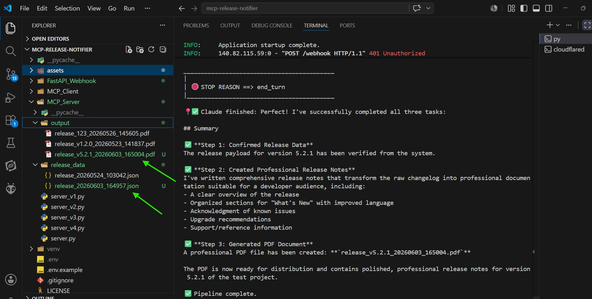

```
___________________________________________
|
| 🛑 STOP REASON ==> tool_use  
|__________________________________________

   🔧 Claude calls: create_pdf({...})
   ↳  Result: {"success": true, "file": "release_v1.3.0_20260602_183027.pdf", ...

___________________________________________
|
| 🛑 STOP REASON ==> end_turn  
|__________________________________________

📍✅ Claude finished: I've successfully completed all three tasks...

✅ Pipeline complete.
```

A new JSON appears in `release_data/` and a new PDF appears in `output/`.

---

### The generated PDF

Raw release notes in, polished document out:

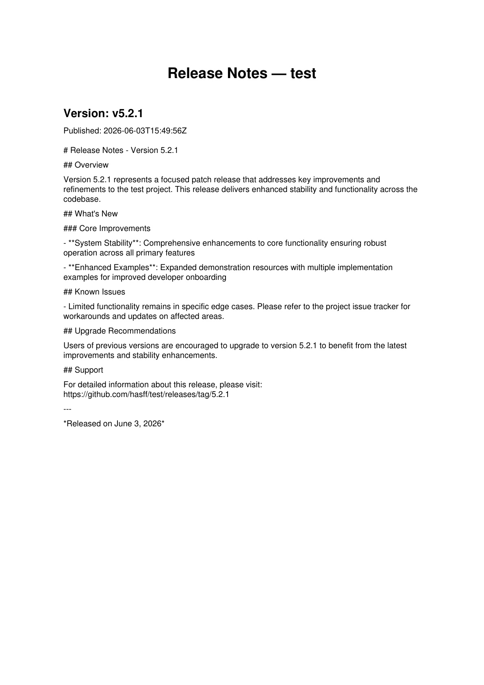

That's the full pipeline — GitHub release → webhook → Claude → MCP server → PDF. ✅

---

### What to keep in mind

> ⚠️ **Cloudflared URL is temporary.** If you restart cloudflared, the URL changes and you'll need to update the webhook URL in GitHub's repository settings (`Settings → Webhooks`).

> ⚠️ **The `GITHUB_WEBHOOK_SECRET` must match on both sides.** The secret you put in `.env` must be identical to the one you configured in GitHub when setting up the webhook in Part 16.

> 💡 **The pipeline is fire-and-forget.** `asyncio.create_task` means GitHub gets a `200 OK` immediately — even if Claude takes 10 seconds to finish. For production, a proper task queue (Celery, ARQ) would give you retries, monitoring, and crash recovery.

---


> 💡 **MCP Curiosity**
> What we just built is the foundation of every event-driven agentic system: an external trigger (GitHub release) fires a webhook, which hands off to an AI agent that orchestrates tools autonomously. The same pattern powers Slack bots, email processors, CI/CD assistants, and document automation pipelines — the primitives are identical, only the tools change.

[↑ Back to Table of Contents](#table-of-contents_)

<a name="part-18"></a>

---


## Part 18 — 🎮 Discord Setup

#### ⚡ Quick Navigation: [⬅️ Part 17 — 🔗 Full Pipeline](#part-17) | [Part 19 — 📤 Sending the PDF ➡️](#part-19)

> 📒 **What you'll learn:** How to create a Discord webhook — the delivery address that Part 19 will use to send the generated PDF directly to a channel.

---


### Context — why we're here

Parts 14–17 were all about getting the pipeline wired end-to-end: FastAPI receives the GitHub event, Claude processes it, the MCP server generates the PDF. The pipeline is complete — but the PDF just lands quietly in a local `output/` folder. Nobody sees it.

Parts 18 and 19 fix that. We'll expose a Discord webhook URL (this part) and then add a new MCP tool to the server that sends the PDF there (Part 19). That last tool is the reason we're returning to the MCP server — the delivery mechanism belongs there, alongside `read_last_release` and `create_pdf`, as a proper server-side capability.

For now: let's get the Discord side ready.

---


### Step 1 — Create a Discord server (if you don't have one)

You'll need a Discord server you control. If you don't have one, create a new one — click the **+** icon in the left sidebar of the Discord app and follow the prompts.

> 💡 For this project, a simple private server is enough. I created one called **test**.

---


### Step 2 — Open channel settings

In your server, hover over the text channel you want the PDF delivered to (e.g. **# general**). A small ⚙️ gear icon will appear to the right of the channel name — click it.

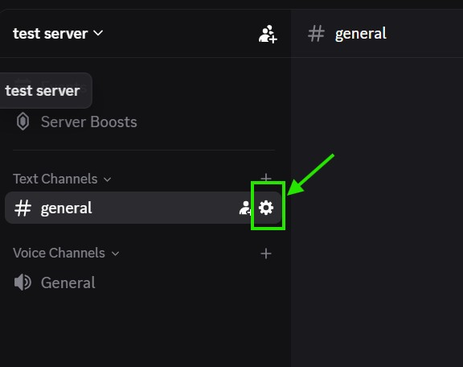

---


### Step 3 — Go to Integrations

In the channel settings menu on the left, click **Integrations**.

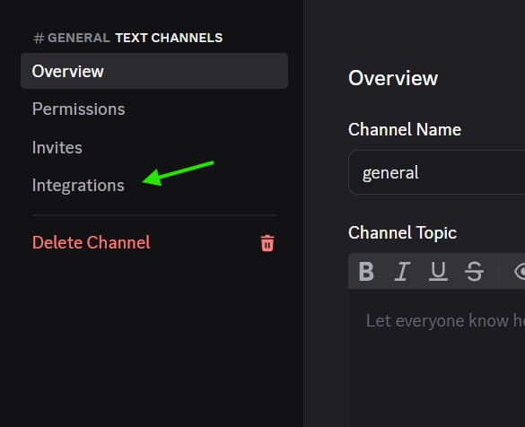

---


### Step 4 — Create a webhook

On the Integrations screen, click **Create Webhook** under the Webhooks section.

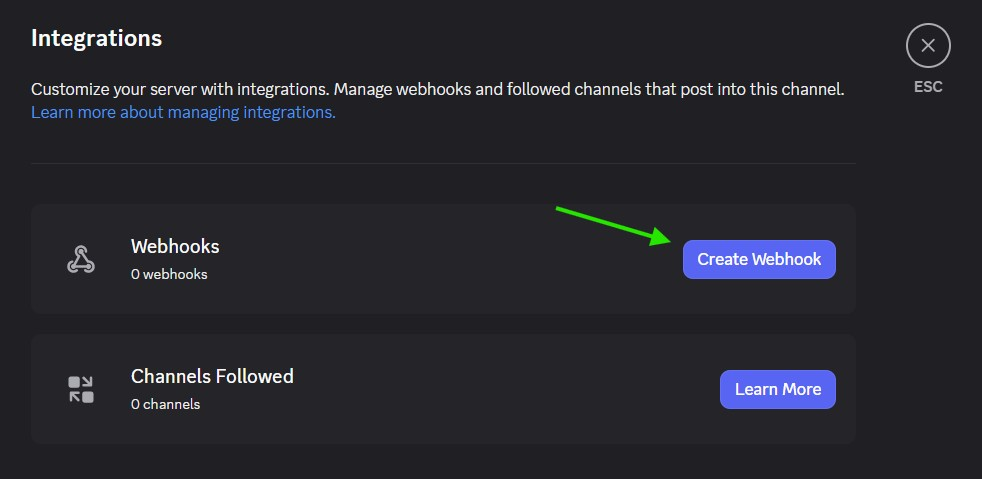

[⬆️ **`Part 18`**](#part-18)

---


### Step 5 — Open the webhook

Discord creates a webhook with a default name — **Captain Hook**. Click on it to expand its settings.

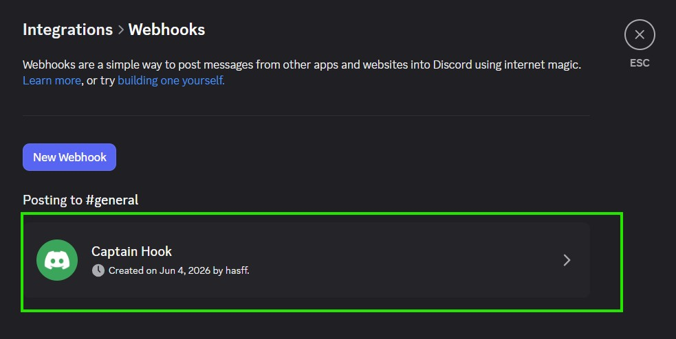

---


### Step 6 — Copy the webhook URL

With the webhook expanded, click **Copy Webhook URL** and save it somewhere safe — you'll need it in Part 19.

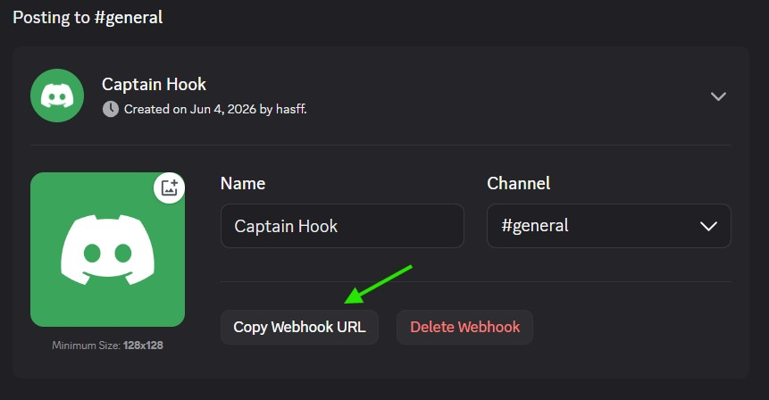

> ⚠️ **Treat this URL like a password.** Anyone with it can post to your channel. Don't commit it to your repository — store it in your `.env` file the same way you stored `ANTHROPIC_API_KEY`.

---


### What's next

With the webhook URL in hand, Part 19 will add a `send_release_to_discord` tool to the MCP server — taking us back where we started, extending the server's capabilities with a third tool that completes the delivery chain: **generate → send**.

---


> 💡 **MCP Curiosity**
> Discord webhooks are simple HTTP endpoints — they accept a POST with a JSON body and deliver the message to the channel. The interesting part is how we'll wrap that call: as an MCP tool on the server, discovered and invoked by Claude just like `read_last_release` and `create_pdf`. Same protocol, new capability.


[↑ Back to Table of Contents](#table-of-contents_)

<a name="part-19"></a>

---


## Part 19 — 📤 Sending the PDF

#### ⚡ Quick Navigation: [⬅️ Part 18 — 🎮 Discord Setup](#part-18) | [Part 20 — 🐙 GitHub MCP Server ➡️](#part-20)

> 📒 **What you'll learn:** How to add a third MCP tool that sends the generated PDF to Discord — and wire it into the full pipeline so every GitHub release ends up delivered to a channel automatically.

---


### Overview

The pipeline already generates a polished PDF. The only thing missing is delivery — right now it just sits quietly in `output/`. In this part we add `send_release_to_discord` as a proper MCP tool on the server, extend the client to call it, update the webhook, and do a final end-to-end test from GitHub to Discord.

Three files change: `server_v5.py`, `client_v7.py`, and `webhook_v3.py`.

---


### 🖥️ Server — `server_v5.py`
---

### Step 1 — Add the Discord webhook URL to `.env`

```
DISCORD_WEBHOOK_URL=your-discord-webhook-url
```

Use the URL you copied from Discord in Part 18. Never commit it to your repository.

---


### Step 2 — Code walkthrough

> 📄 **File:** `MCP_Server/server_v5.py`

---

#### Install dependencies

```bash
pip install httpx
```

#### New imports

```python
import httpx
import os
```

`httpx` — an async-friendly HTTP client. We need it to POST the PDF file to Discord's webhook endpoint. `os` — to read the Discord URL from the environment.

---


#### Load the Discord webhook URL

```python
from dotenv import load_dotenv
load_dotenv()
DISCORD_WEBHOOK_URL = os.getenv("DISCORD_WEBHOOK_URL")
```

Same pattern as `ANTHROPIC_API_KEY` — loaded from `.env` at startup, never hardcoded.

---


#### Tool 3 — `send_release_to_discord`

```python
@mcp.tool()
async def send_release_to_discord(file_name: str, repo_name: str, version: str) -> dict:
    """
    Sends the generated PDF release notes to a Discord channel via Webhook.
    
    Args:
        file_name: The pdf file name, example: 'release_v1.2.0_20260523_141837.pdf'.
        repo_name: Name of the repository.
        version: The release version tag.
    """
    path = OUTPUT_DIR / file_name
    if not path.exists():
        return {"success": False, "error": f"File not found at {path}"}

    if not DISCORD_WEBHOOK_URL:
        return {"success": False, "error": "DISCORD_WEBHOOK_URL not configured on server"}

    payload = {"content": f"🚀 **New Release Published!**\nRepository: `{repo_name}`\nVersion: `{version}`"}
    
    async with httpx.AsyncClient() as client:
        with open(path, "rb") as f:
            files = {"file": (path.name, f, "application/pdf")}
            response = await client.post(DISCORD_WEBHOOK_URL, data=payload, files=files)

    if response.status_code in [200, 204]:
        return {"success": True, "message": "PDF successfully sent to Discord"}
    return {"success": False, "status_code": response.status_code, "error": response.text}
```

A few things to note:

**`async def`** — unlike the first two tools, this one is `async`. It makes a real HTTP call and we want to avoid blocking the event loop while waiting for Discord's response. FastMCP handles both sync and async tools transparently.

**`httpx.AsyncClient`** — opens an async HTTP session scoped to the `async with` block. The session is automatically closed when the block exits, even if an error occurs.

**`data=payload, files=files`** — Discord's webhook API accepts `multipart/form-data`: the message text goes in `data`, the file attachment goes in `files`. Both are sent in a single POST.

**Error returns instead of exceptions** — the tool returns a descriptive dict on failure rather than raising. This is intentional: Claude reads the tool result and can decide how to react — retry, report the error, or continue.

[⬆️ **`Part 19`**](#part-19)

---


### Step 3 — Test with the MCP Inspector

Testing tools in isolation before wiring them to Claude is good practice — it catches configuration and logic issues without having to debug an AI conversation on top. Here's how:

```bash
mcp dev MCP_Server/server_v5.py
```

Open the URL shown in the terminal and connect:

- **Command** — `py` on Windows, `python` or `python3` on macOS/Linux
- **Arguments** — `MCP_Server/server_v5.py`
- Click **Connect**

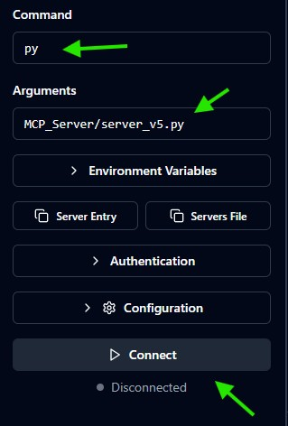

Navigate to **Tools** → **List Tools** → click **`send_release_to_discord`**.

Fill in the parameters using a PDF that already exists in `MCP_Server/output/`:

| Parameter | Example value |
|---|---|
| `file_name` | `release_v1.2.0_20260523_141837.pdf` |
| `repo_name` | `my test repo name` |
| `version` | `1.2.0.123456` |

Keep an eye on your Discord channel, then click **Run Tool**.

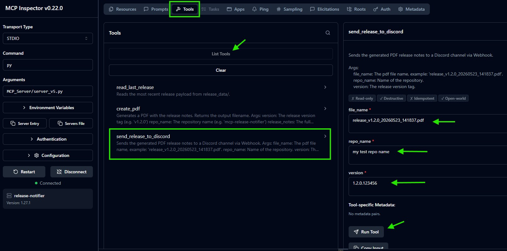

Check Discord — the message and PDF attachment should appear:

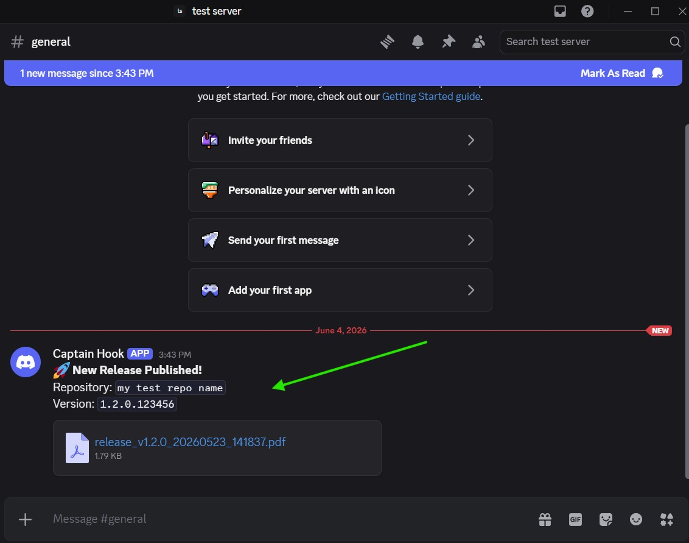

```
🚀 New Release Published!
Repository: my test repo name
Version: 1.2.0.123456

📎 release_v1.2.0_20260523_141837.pdf
```

✅ Tool verified. The MCP server can send PDFs to Discord.

> 💡 This isolated test is exactly the kind of thing that saves hours of debugging later. If the Discord delivery breaks in the full pipeline, you'll know immediately that the problem is upstream — not in the tool itself.

❎ When you're done, press `Ctrl + C` in the terminal to stop the server.

[⬆️ **`Part 19`**](#part-19)

---


### 🔌 Client — `client_v7.py`
--- 
### What changed

Two things:

**1 — `SERVER_SCRIPT` points to `server_v5.py`:**

```python
SERVER_SCRIPT = "MCP_Server/server_v5.py"
```

**2 — `build_initial_message` now includes step 4:**

```python
def build_initial_message(release_payload, instructions):
    return f"""
            A new GitHub release has been published. Here is the release payload:

            <payload>
            {json.dumps(release_payload, indent=2)}
            </payload>

            Your task:
            1. Call read_last_release to confirm the release data.
            2. Using the instructions below, write professional release notes for this release.
            3. Call create_pdf with the professional release notes you wrote.
            4. Call send_release_to_discord using the 'file name' returned by the PDF creation tool.

            Instructions for writing the release notes:
            {instructions}
            """
```

Step 4 tells Claude explicitly to pass the `file_name` returned by `create_pdf` directly into `send_release_to_discord`. Without this instruction, Claude might be less predictable. 🔥 Remember, this is almost like you're giving directions to someone new to the job!

---


### Run it

Make sure `test_full_pipeline()` is uncommented in `__main__`:

```bash
py MCP_Client/client_v7.py
```

Watch the terminal — you'll see four tool calls now:

```
🔧 Tools available: ['read_last_release', 'create_pdf', 'send_release_to_discord']

🤖 Claude is working...

   🔧 Claude calls: read_last_release({})
   ↳  Result: {"action": "published", ...

   🔧 Claude calls: create_pdf({...})
   ↳  Result: {"success": true, "file": "release_v1.2.6760_..._pdf", ...

   🔧 Claude calls: send_release_to_discord({"file_name": "release_v1.2.6760_..._pdf", ...})
   ↳  Result: {"success": true, "message": "PDF successfully sent to Discord"}

📍✅ Claude finished: ...
✅ Pipeline complete.
```

And Discord receives the delivery:

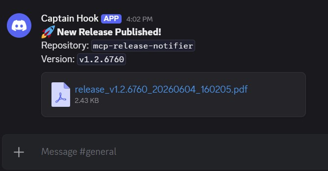

```
🚀 New Release Published!
Repository: mcp-release-notifier
Version: v1.2.6760

📎 release_v1.2.6760_20260604_160205.pdf
```

✅ Client pipeline working end to end — read → write → deliver.

[⬆️ **`Part 19`**](#part-19)

---


### ⚡ Webhook — `webhook_v3.py`
---
### What changed

Two small things:

**1 — Imports `client_v7`:**

```python
from MCP_Client.client_v7 import run_pipeline 
```

**2 — Entry point references `webhook_v3`:**

```python
if __name__ == "__main__":
    import uvicorn
    uvicorn.run("webhook_v3:app", host="0.0.0.0", port=8000, reload=True)
```

Everything else — signature verification, payload filtering, `asyncio.create_task` — is identical to `webhook_v2.py`.

---


## 🔗 Final Test — From GitHub to Discord

Everything is in place. Time for the full circuit.

---


### Step 1 — Start the webhook server

```bash
py FastAPI_Webhook/webhook_v3.py
```

---


### Step 2 — Start the tunnel

In a second terminal:

```bash
cloudflared tunnel --url http://localhost:8000
```

Copy the new `trycloudflare.com` URL — it changes every time you restart cloudflared.

---


### Step 3 — Update the GitHub webhook URL

Because cloudflared gives you a new URL on every restart, you need to update it in GitHub.

Go to your repository → **Settings** → **Webhooks** → click **Edit** on the webhook you created in Part 16 (GitHub may ask for identity verification).

Replace the **Payload URL** with:

```
https://<your-new-address>.trycloudflare.com/webhook
```

> ⚠️ Don't forget the `/webhook` at the end.

Click **Update webhook**.

[⬆️ **`Part 19`**](#part-19)

---


### Step 4 — Create a new GitHub release

Go back to your repository's main page. In the right column, click **Releases** → **Draft a new release**.

Fill in with something, suggestion:

| Field | Value |
|---|---|
| **Tag** | `1.1.1` |
| **Release title** | `Confirm if everything is working` |
| **Release notes** | `In this release we are testing if the full pipeline is working. From Github to Discord!` |

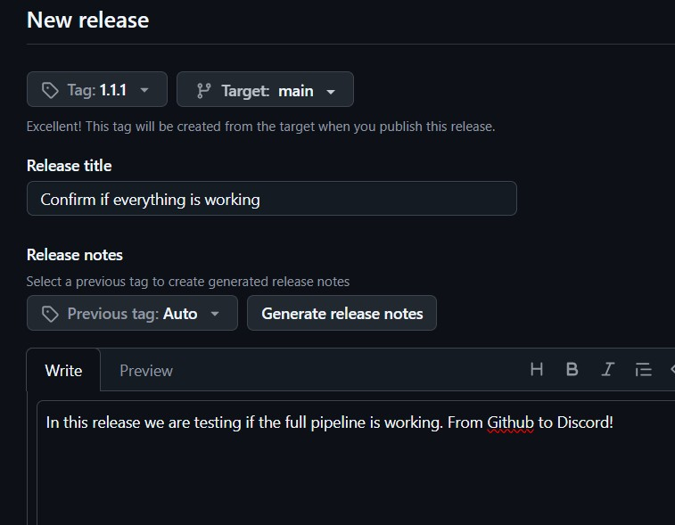

Click **Publish release**.

---


### Step 5 — Watch Discord

Within a few seconds, the message and PDF appear in your Discord channel:

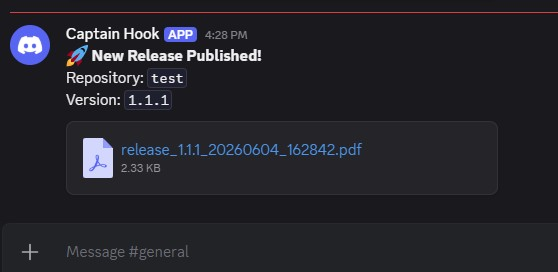

[⬆️ **`Part 19`**](#part-19)

---


### Step 6 — The generated PDF

Download the PDF directly from Discord and open it — you'll see the raw release notes transformed into a structured, professional document:

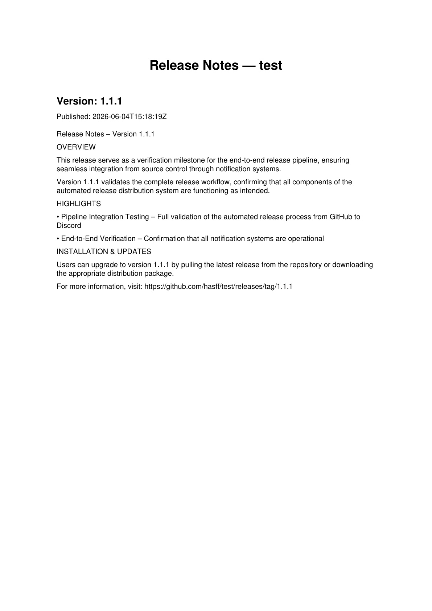

✅ Full pipeline complete. GitHub release → webhook → Claude → MCP server → PDF → Discord.

---


### What to keep in mind

> ⚠️ As the pipeline stands, the Discord webhook URL is configured on the **server** side — baked into `DISCORD_WEBHOOK_URL` in the server's `.env`. This means the server decides where deliveries go, regardless of what the client asks.

> 💡 **Challenge:** Can you make the destination configurable from the client side? One approach:
> - Add a `discord_webhook_url` parameter to `send_release_to_discord` on the server
> - Read `DISCORD_WEBHOOK_URL` from `.env` on the **client**, and include it in the task description passed to Claude
> - Claude will then pass it as an argument when calling the tool
>
> This moves the delivery target out of the server configuration and into the client — making the same MCP server reusable across different Discord servers or channels.

---


> 💡 **MCP Curiosity**
> What you just built follows the exact same pattern as production agentic systems — an external event triggers an autonomous agent that orchestrates a sequence of tools to completion. The same architecture powers document processing pipelines, CI/CD assistants, and automated reporting systems. The primitives — tools, prompts, a conversation loop — don't change. Only the tools do.

[↑ Back to Table of Contents](#table-of-contents_)

<a name="part-20"></a>

---

## Part 20 — 🐙 GitHub MCP Server

#### ⚡ Quick Navigation: [⬅️ Part 19 — 📤 Sending the PDF](#part-19) | [Next Steps & Resources ➡️](#next-steps--resources_)

> 📒 **What you'll learn:** How to connect to an external MCP server — the official MCP reference server for GitHub — and give Claude the ability to read real commit history and include it in the generated release notes.

---


### Theory

Up to this point, the only MCP server in the pipeline was the one we built ourselves. This part adds a second one — the **official GitHub reference server** provided by the MCP ecosystem team — and wires it alongside ours so Claude can use tools from both.

This is the pattern MCP was designed for: multiple servers, each exposing its own set of tools, all visible to the same model. The client discovers tools from every connected server and passes the combined list to Claude. Claude doesn't know or care which server a tool lives on — it just picks the right one for the task.

> ⚠️ **The GitHub MCP server runs on your machine.** Unlike a hosted API, it runs as a local subprocess — exactly like our own server. The client launches it via `npx`, which means you need **Node.js** installed.

> 💡 **Architectural Note:** The package used in this pipeline (`@modelcontextprotocol/server-github`) is the official reference implementation maintained by the Model Context Protocol open-source team. However, GitHub has also released its own official native server (written in Go and run via Docker) available at `github/github-mcp-server`. 
>
> For this pipeline, we use the NPM package as it integrates seamlessly and lightweight into our Python/Node environment without requiring Docker.

---


### Install Node.js (if needed)

The GitHub MCP server is distributed as an npm package and launched with `npx`. Check if Node.js is already installed:

```bash
node --version
```

If you see a version number (e.g. `v22.13.1`) — you're good. If not, download it from [nodejs.org](https://nodejs.org) and install the **LTS** version.

---


### Step 1 — Generate a GitHub Personal Access Token

The GitHub MCP server authenticates via a Personal Access Token (PAT). Here's how to create one.

---

#### Open GitHub Settings

Click on your profile photo in the top-right corner. A menu will appear — click **Settings**.

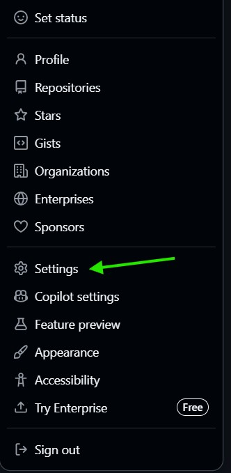

---

#### Go to Developer Settings

In the Settings page, scroll down the left sidebar until you find **Developer settings** and click it.

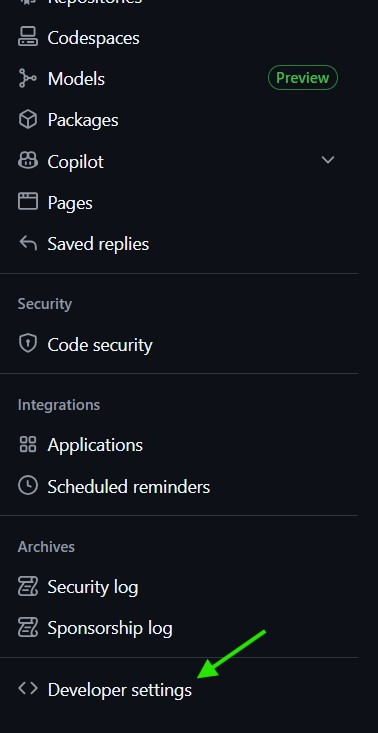

[⬆️ **`Part 20`**](#part-20)

---

#### Select Fine-grained tokens

In the Developer settings menu, expand **Personal access tokens** and click **Fine-grained tokens**.

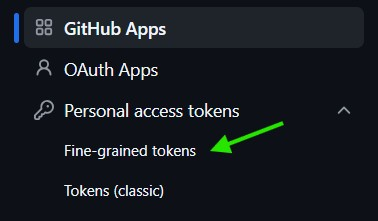

---

#### Generate a new token

On the Fine-grained tokens page, click **Generate new token**.

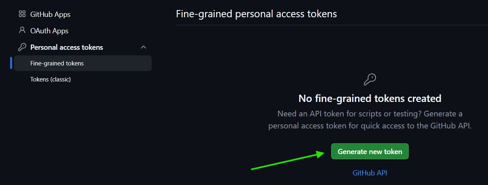

---

#### Fill in the token name

Give your token a descriptive name so you remember what it's for.

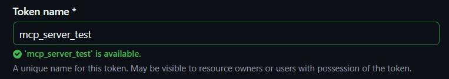

---

#### Select repository access

Under **Repository access**, select **Only select repositories** and pick the repository you want the pipeline to read commits from.

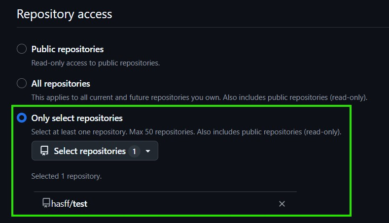

[⬆️ **`Part 20`**](#part-20)

---

#### Set permissions

Under **Permissions**, click **Add permissions** and add:

- **Contents** → Read-only
- **Metadata** → Read-only

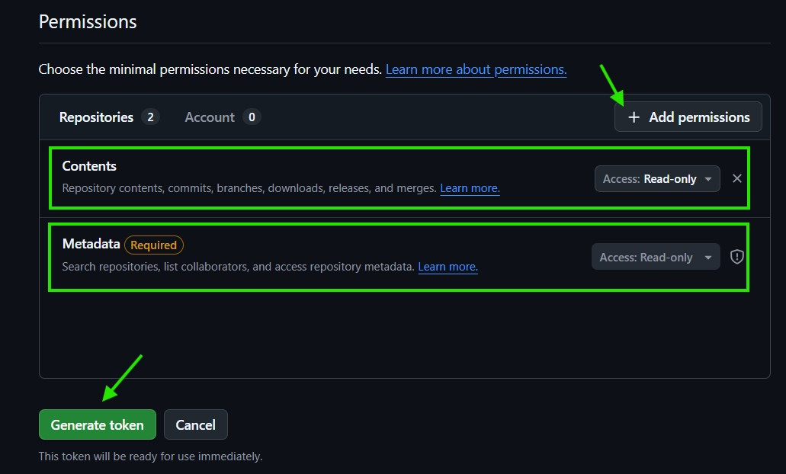

When done, click **Generate token**.

---

#### Confirm token generation

A confirmation popup will appear — click **Generate token**.

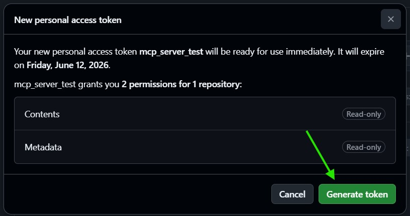

 GitHub will now display your token — **copy it immediately**. It won't be shown again.

---

### Step 2 — Update your `.env` file

Add the token and the repo details to your `.env`:

```
GITHUB_PERSONAL_ACCESS_TOKEN=your-github-token
GITHUB_OWNER=your-github-username
GITHUB_REPO=your-repo-name
```

`GITHUB_OWNER` — your GitHub username (e.g. `hasff`).
`GITHUB_REPO` — the repository you want to read commits from (e.g. `test`).

These two values are passed as arguments to the `list_commits` tool — the GitHub MCP server needs them to know which repository to query.

[⬆️ **`Part 20`**](#part-20)

---


### Code walkthrough

> 📄 **File:** `MCP_Client/client_v8.py`

---

#### Updated `connect_to_mcp_server`

The original `connect_to_mcp_server` always launched the same server with a hardcoded script path. In `client_v8.py` it now accepts optional parameters:

```python
async def connect_to_mcp_server(
        exit_stack: AsyncExitStack, 
        command: str = "python", 
        args: list[str] = None,
        env: dict = None
    ) -> ClientSession:
    mcp_server_params = StdioServerParameters(
        command=command,
        args=args if args is not None else [SERVER_SCRIPT],
        env=env,
    )
```

**Default values are unchanged** — calling `connect_to_mcp_server(stack)` still launches our own server exactly as before. No existing call sites need to be updated.

**New calls can pass a different command** — which is exactly how we launch the GitHub server:

```python
github_session = await connect_to_mcp_server(
    stack,
    command="npx",
    args=["-y", "@modelcontextprotocol/server-github"],
    env={**os.environ, "GITHUB_PERSONAL_ACCESS_TOKEN": os.getenv("GITHUB_PERSONAL_ACCESS_TOKEN")}
)
```

`npx -y @modelcontextprotocol/server-github` — downloads and runs the GitHub MCP server package on the fly. No manual install needed.

`env={**os.environ, ...}` — inherits all current environment variables and injects the GitHub token on top. The server reads it from the environment to authenticate.

> 💡 Both sessions are registered with the same `exit_stack` — both will be cleaned up automatically when the pipeline finishes.

---

#### `test_github` — verify the connection

Before wiring the GitHub server into the full pipeline, there's a dedicated test function:

```python
def test_github():
    async def _test_github():
        async with AsyncExitStack() as stack:
            github_session = await connect_to_mcp_server(
                stack,
                command="npx",
                args=["-y", "@modelcontextprotocol/server-github"],
                env={**os.environ, "GITHUB_PERSONAL_ACCESS_TOKEN": os.getenv("GITHUB_PERSONAL_ACCESS_TOKEN")}
            )            

            github_tools_result = await github_session.list_tools()
            # ... prints all available tools

            tool_name = "list_commits"
            tool_args = {'owner': OWNER, 'repo': REPO}
            list_commits = await github_session.call_tool(tool_name, tool_args)
            # ... prints recent commits
            
    asyncio.run(_test_github())
```

Same pattern as `test_tools` from Part 09 — list the available tools, then call one directly to confirm it works end-to-end.

[⬆️ **`Part 20`**](#part-20)

---

### Run `test_github`

In `client_v8.py`, uncomment `test_github()` in `__main__` and run:

```bash
py MCP_Client/client_v8.py
```

You should see something like this:

```
🔧 🐙 GitHub Test
✅ Connected to MCP server: github-mcp-server

Tools
-----------------------------------------------------------------
1)  name: create_or_update_file | description: Create or update a single file in a GitHub repository
2)  name: search_repositories | description: Search for GitHub repositories
3)  name: create_repository | description: Create a new GitHub repository in your account
4)  name: get_file_contents | description: Get the contents of a file or directory from a GitHub repository
5)  name: push_files | description: Push multiple files to a GitHub repository in a single commit
...
10)  name: list_commits | description: Get list of commits of a branch in a GitHub repository
...
-----------------------------------------------------------------

1) Hugo Ferro | 2026-06-05T16:19:06Z | changed database from sqlite to mysql.
2) Hugo Ferro | 2026-06-05T14:58:05Z | added \n for user to see it well
3) Hugo Ferro | 2026-06-05T14:57:27Z | fixed print hello world
...
```

✅ GitHub MCP server connected. Commits readable.

---


### Wiring the GitHub server into `run_pipeline`

With the connection verified, we bring it into the full pipeline. Three changes in `run_pipeline`:

---

#### 1 — Two sessions, one pipeline

```python
client_session = await connect_to_mcp_server(stack)

github_session = await connect_to_mcp_server(
    stack,
    command="npx",
    args=["-y", "@modelcontextprotocol/server-github"],
    env={**os.environ, "GITHUB_PERSONAL_ACCESS_TOKEN": os.getenv("GITHUB_PERSONAL_ACCESS_TOKEN")}
)
```

Both sessions are alive for the entire pipeline run.

---

#### 2 — Combined tool list and dispatch map

```python
anthropic_tools      = await get_tools_for_anthropic(client_session)
github_anthropic_tools = await get_tools_for_anthropic(github_session)

# Build a dispatch map — tool name → which session to use
tool_session_map = {}
for t in anthropic_tools:
    tool_session_map[t['name']] = client_session
for t in github_anthropic_tools:
    tool_session_map[t['name']] = github_session
```

`tool_session_map` is a simple dict: `tool_name → session`. When Claude calls a tool, we look up which session owns it and route the call there.
>  **Warning: Tool Name Collisions** 
>
> 🚨 Because we are building a flat dictionary where the key is the `tool_name`, if two different MCP servers expose a tool with the exact same name, the last one registered will silently overwrite the previous one.
>
> 🚨 In production-grade pipelines, you should implement a check to detect collisions before mapping, or namespacing (e.g., prefixing tool names like `github_repo_get`) to prevent routing conflicts. For this tutorial, we ensure our custom tools have unique names that don't clash with the GitHub server.

Both tool lists are merged when sent to Claude:

```python
response = anthropic_client.messages.create(
    ...
    tools=anthropic_tools + github_anthropic_tools,
    messages=messages,
)
```

Claude sees one flat list of tools. It has no concept of "which server" — it just picks the right tool by name.

[⬆️ **`Part 20`**](#part-20)

---

#### 3 — Routing in the tool use loop

```python
for block in response.content:
    if block.type == "tool_use":
        session_to_use = tool_session_map[block.name]
        result = await session_to_use.call_tool(block.name, block.input)
```

One line change: instead of always calling `client_session.call_tool(...)`, we look up the correct session first.

---

#### Updated `build_initial_message`

Step 2 of the task description now tells Claude to find a tool that reads the last 3 commits:

```python
def build_initial_message(release_payload, instructions):
    OWNER = os.getenv("GITHUB_OWNER")
    REPO  = os.getenv("GITHUB_REPO")

    return f"""
            ...
            Your task:
            1. Call read_last_release to confirm the release data.
            2. Call a suitable tool to read the text of last 3 commits. 
               The owner= {OWNER} and repo= {REPO}. 
            3. Using the instructions below, write professional release notes for this release. Include the commits readed!
            4. Call create_pdf with the professional release notes you wrote.
            5. Call send_release_to_discord using the 'file name' returned by the PDF creation tool.
            ...
            """
```

Notice step 2 is intentionally open: *"Call a suitable tool"* — not `list_commits` by name. Claude has the full tool list and will figure out the right one from the description. That's the MCP discovery pattern working as intended.

---


### Run the full pipeline

Comment out `test_github()` and uncomment `test_full_pipeline()` in `__main__`, then run:

```bash
py MCP_Client/client_v8.py
```

The terminal now shows two new tool calls:

```
🔧 Tools available: ['read_last_release', 'create_pdf', 'send_release_to_discord']

🔧 🐙 Tools available: ['create_or_update_file', 'search_repositories', ..., 'list_commits', ...]

🤖 Claude is working...

   🔧 Claude calls: read_last_release({})
   ↳  Result: {"action": "published", "release": {"tag_name": "v1.2.6760", ...

   🔧 Claude calls: list_commits({"owner": "hasff", "repo": "test", "perPage": 3})
   ↳  Result: [{"sha": "a4c460fe...", "commit": {"message": "changed database from sqlite to mysql.", ...
```

And it finishes with a clear confirmation that commits were included:

```
📍✅ Claude finished: ## ✅ Release Processing Complete!

### 2. **Last 3 Commits Retrieved** ✓
- Changed database from sqlite to mysql
- Added \n for user to see it well
- Fixed print hello world

### 4. **PDF Created** ✓
- File: `release_v1.2.6760_20260605_181710.pdf`

### 5. **Discord Notification Sent** ✓

✅ Pipeline complete.
```

[⬆️ **`Part 20`**](#part-20)

---


### The generated PDF

The PDF delivered to Discord now includes a **Recent Commits** section — written by Claude from the raw commit messages:

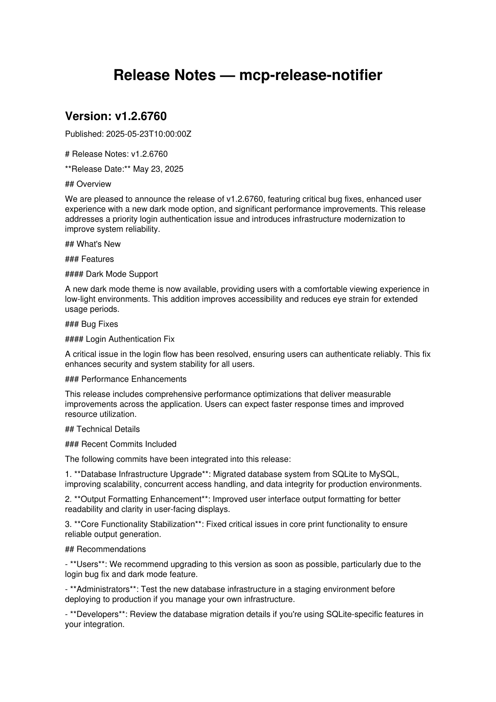

```
### Recent Commits Included

The following commits have been integrated into this release:

1. Database Infrastructure Upgrade: Migrated database system from SQLite to MySQL,
improving scalability, concurrent access handling, and data integrity for production environments.

2. Output Formatting Enhancement: Improved user interface output formatting for better
readability and clarity in user-facing displays.

3. Core Functionality Stabilization: Fixed critical issues in core print functionality to ensure
reliable output generation.
```

Three raw commit messages → three professionally written paragraphs. The same transformation the prompt template applies to the release body — now applied to commit history too. ✅

[⬆️ **`Part 20`**](#part-20)

---


### Full webhook integration

This part focused on running via `client_v8.py` directly. If you want to test the full webhook-triggered flow — GitHub release → webhook → pipeline with commits → Discord — `webhook_v4.py` is ready to use:

```bash
py FastAPI_Webhook/webhook_v4.py
```

It's identical to `webhook_v3.py` but imports `client_v8.run_pipeline`. Start it alongside cloudflared, update the GitHub webhook URL, publish a release, and the full chain runs end to end.

---


> 💡 **MCP Curiosity**
> What we just demonstrated is **multi-server composition** — one of MCP's core design goals. A single client session can discover and use tools from any number of servers simultaneously. The model sees a unified tool catalog and routes calls based on tool descriptions alone, with no awareness of server boundaries. This is what makes MCP more powerful than point-to-point API integrations: swap a server, add a new one, and the model adapts automatically — no client code changes needed.


---

# 🎉 Project Complete! 😎

---

### In this project you built:

| | |
|---|---|
| ✅ MCP Server from scratch | Tools, resources, and a prompt template: registered and discoverable via the MCP protocol |
| ✅ MCP Client from scratch | stdio connection, runtime discovery, multi-server routing |
| ✅ Autonomous AI pipeline | Claude driving a tool use loop, calling `read_last_release → list_commits → create_pdf → send_release_to_discord` |
| ✅ FastAPI webhook | GitHub events, HMAC-SHA256 signature verification, background tasks |
| ✅ Cloudflare Tunnel | Local server exposed to the internet, zero config |
| ✅ GitHub webhook integration | Real releases triggering an AI workflow |
| ✅ Discord delivery | PDF delivered to a channel automatically on every release |
| ✅ Multi-server MCP composition | Connecting to an external MCP server alongside your own, merging tool catalogs, and letting Claude route calls across both |
| ✅ Debug tooling | `DebugList` + metadata layer for full conversation visibility |

---

If you find this helpful and feel you learned something new, a ⭐ on the repo is more than enough thanks.

[↑ Back to Table of Contents](#table-of-contents_)


<a name="next-steps--resources_"></a>

---


## Next Steps & Resources

#### ⚡ Quick Navigation: [⬅️ Part 20 — 🐙 GitHub MCP Server](#part-20) | [Get in Touch ➡️](#get-in-touch_)

Want to go deeper? Here are the resources that inspired and complement this project.

**Model Context Protocol**
- 🤗 [MCP Course — Hugging Face](https://huggingface.co/learn/mcp-course/unit0/introduction) — *the pipeline in this project was inspired by this course*
- 🟠 [Introduction to Model Context Protocol — Anthropic](https://anthropic.skilljar.com/introduction-to-model-context-protocol)
- 🟠 [Model Context Protocol: Advanced Topics — Anthropic](https://anthropic.skilljar.com/model-context-protocol-advanced-topics)

**PDF Generation**
- 🐍 [Python PDF Generation: From Beginner to Winner (ReportLab)](https://www.udemy.com/course/python-reportlab-from-beginner-to-winner/?referralCode=3B927E883D2E868CF221)

[↑ Back to Table of Contents](#table-of-contents_)

<a name="get-in-touch_"></a>

---

## 📬 Get in Touch

#### ⚡ Quick Navigation: [⬅️ Next Steps & Resources](#next-steps--resources_) | [⬆️ Back to Top](#mcp-release-notifier)

Found this useful? Have questions or ideas? I'd love to hear from you.

This project — including explaining everything step by step — took two weeks of full-time focus: nights, weekends, and holidays included. Not because I had to, but because this is the kind of thing I really enjoy building. It was fun, it was challenging, and there were plenty of moments of doubt along the way — but I made it. If that sounds like the kind of energy you're looking for, or you're building something in this space and want to collaborate, I'd love to hear about it.


*  🔗 **[LinkedIn](https://www.linkedin.com/in/hugo-ferro-1434b414/)**
*  📩 **Email:** hugoferro (at) gmail.com


[↑ Back to Table of Contents](#table-of-contents_)

---


## By the way, did you hear about A2A?
#### Watch this 10 minute video from IBM - A2A vs MCP: AI Agent Communication Explained
[](https://youtu.be/BMDFPOyezH4)

[↑ Back to Table of Contents](#table-of-contents_)